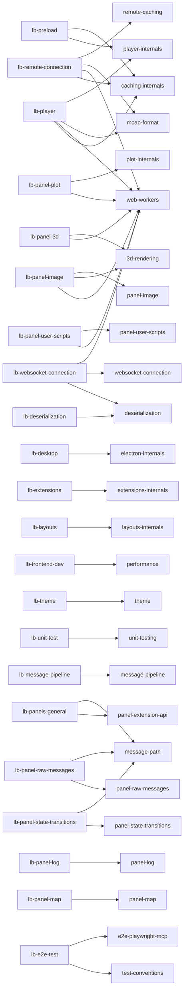

# AI Agent System

This document describes the AI agent architecture used in the Lichtblick monorepo to assist with development tasks via GitHub Copilot.

## Structure Overview

```
.github/
├── agents/          # Domain-specific agent definitions (.agent.md)
├── skills/          # Deep-dive knowledge modules (SKILL.md)
├── prompts/         # Reusable workflow prompts (.prompt.md)
└── instructions/    # Auto-applied coding conventions (.instructions.md)
```

### How It Works

- **Agents** are invoked by name (e.g., `@lb-player`) to handle tasks in a specific domain. Each agent has a description, allowed tools, and domain knowledge embedded in its markdown body.
- **Skills** are loaded on-demand by agents when they need deeper implementation knowledge. An agent's body references skills by name (e.g., "load `player-internals` skill").
- **Instructions** are applied automatically to every file matching their `applyTo` glob pattern. They enforce coding conventions without explicit invocation.

---

## Agents (24)

Located in `.github/agents/`. Each file uses YAML frontmatter with `description` and `tools` fields.

### Orchestrator

| Agent             | Description                                                                                                                                                                          |
| ----------------- | ------------------------------------------------------------------------------------------------------------------------------------------------------------------------------------ |
| `lb-orchestrator` | Top-level orchestrator that routes tasks to specialized sub-agents based on domain expertise. Use when unsure which specialist to invoke, or for tasks spanning multiple subsystems. |

### Platform

| Agent        | Description                                                                                                                                                                                               |
| ------------ | --------------------------------------------------------------------------------------------------------------------------------------------------------------------------------------------------------- |
| `lb-desktop` | Desktop/Electron platform specialist covering the main process, preload scripts, IPC communication, BrowserWindow management, native menus, and file system access.                                       |
| `lb-web`     | Web platform specialist covering the browser-based Lichtblick build: webpack configuration, COOP/COEP headers, browser compatibility, SharedArrayBuffer requirements, and web-specific data source setup. |

### Core Infrastructure

| Agent                 | Description                                                                                                                                  |
| --------------------- | -------------------------------------------------------------------------------------------------------------------------------------------- |
| `lb-player`           | Player layer specialist covering IterablePlayer state machine, FoxgloveWebSocketPlayer, UserScriptPlayer, and data source lifecycle.         |
| `lb-message-pipeline` | MessagePipeline specialist covering the React context, zustand store, subscription management, and render state building.                    |
| `lb-preload`          | Preloading and caching specialist covering BlockLoader, CachingIterableSource, BufferedIterableSource, and `unstable_subscribeMessageRange`. |
| `lb-deserialization`  | Deserialization specialist covering schema parsing, message decoding, protobuf/flatbuffer/ROS/JSON schemas, and WASM-based decoders.         |
| `lb-extensions`       | Extension system specialist covering extension loading, registration, the extension API, contribution points, and the .foxe file format.     |
| `lb-layouts`          | Layout system specialist covering layout storage, sync, conflict resolution, permissions, and the CurrentLayoutProvider state machine.       |

### Connections

| Agent                     | Description                                                                                                                                                                                    |
| ------------------------- | ---------------------------------------------------------------------------------------------------------------------------------------------------------------------------------------------- |
| `lb-remote-connection`    | Remote file connection specialist covering HTTP range requests, MCAP remote reading, CachedFilelike caching, MultiIterableSource multi-file orchestration, and file-based data source loading. |
| `lb-websocket-connection` | WebSocket connection specialist covering FoxgloveWebSocketPlayer, WorkerSocketAdapter, and the Foxglove WebSocket protocol.                                                                    |

### Panels

| Agent                        | Description                                                                                                                                                                         |
| ---------------------------- | ----------------------------------------------------------------------------------------------------------------------------------------------------------------------------------- |
| `lb-panels-general`          | General panel infrastructure specialist covering PanelExtensionAdapter, renderState building, panel lifecycle, pauseFrame, and the extension API contract.                          |
| `lb-panel-3d`                | 3D panel specialist covering THREE.js rendering, SceneExtensions, TransformTree, point clouds, GPU buffer management, camera handling, picking, and the ImageMode.                  |
| `lb-panel-image`             | Image panel specialist covering camera image visualization within the 3D rendering context (ImageMode).                                                                             |
| `lb-panel-plot`              | Plot panel specialist covering PlotCoordinator, TimestampDatasetsBuilder, Chart.js Worker rendering, OffscreenCanvas, and time-series data extraction.                              |
| `lb-panel-log`               | Log panel specialist covering virtualized log display, react-window VariableSizeList, dynamic row heights, autoscroll behavior, and log level filtering.                            |
| `lb-panel-map`               | Map panel specialist covering Leaflet integration, GeoJSON rendering, NavSatFix message handling, and the FilteredPointLayer pixel-deduplication system.                            |
| `lb-panel-raw-messages`      | RawMessages panel specialist covering JSON message tree display, virtualized tree rendering with @tanstack/react-virtual, message inspection, diff mode, and field path navigation. |
| `lb-panel-state-transitions` | StateTransitions panel specialist covering discrete state visualization using TimeBasedChart, message-path extraction, and preloaded data range subscriptions.                      |
| `lb-panel-user-scripts`      | UserScripts panel specialist covering the Monaco editor integration, TypeScript compilation, script execution in SharedWorkers, diagnostics, and the user script API.               |

### Development

| Agent             | Description                                                                                                                                                                          |
| ----------------- | ------------------------------------------------------------------------------------------------------------------------------------------------------------------------------------ |
| `lb-frontend-dev` | General React and TypeScript development specialist for the Lichtblick monorepo. Use for component creation, hooks, state management, styling with tss-react/MUI, and code patterns. |
| `lb-unit-test`    | Unit test creation and maintenance specialist. Use for writing new tests, fixing broken tests, improving coverage, and understanding mocking patterns.                               |
| `lb-theme`        | Theme system specialist covering the MUI theme configuration, palette definitions, typography, and the dark/light color scheme implementation.                                       |
| `lb-e2e-test`     | Creates Playwright E2E tests for the Lichtblick desktop (Electron) and web apps. Uses MCP browser for web tests; reads source code to discover selectors for desktop tests.          |

---

## Skills (26)

Located in `.github/skills/<name>/SKILL.md`. Each file uses YAML frontmatter with a `description` field. Skills provide deep implementation knowledge that agents load on demand.

| Skill                       | Description                                                                                                                                                                             |
| --------------------------- | -------------------------------------------------------------------------------------------------------------------------------------------------------------------------------------- |
| `3d-rendering`              | Deep THREE.js rendering knowledge: WebGL pipeline, buffer management, instanced rendering, shader considerations, and scene optimization techniques.                                    |
| `caching-internals`         | Caching strategies, memory budgets, block eviction, and buffered reading in the preloading subsystem.                                                                                   |
| `deserialization`           | Schema parsing and message decoding: parseChannel dispatch, encoding→deserializer mapping, DeserializingIterableSource wrapping, and WASM decompression handlers.                       |
| `electron-internals`        | Electron implementation: main/renderer process communication, contextBridge patterns, BrowserWindow lifecycle, native menu integration, and security.                                   |
| `extensions-internals`      | Extension system internals: IExtensionLoader contracts, IndexedDB storage schema, version-compare cache strategy, contribution point registration, extension sandbox, and .foxe format. |
| `layouts-internals`         | Layout system internals: ILayoutStorage contracts, IndexedDB schema, sync operation computation, mutex-locked LayoutManager, and conflict resolution.                                   |
| `mcap-format`               | MCAP file format specification: binary structure, record types, indexing strategies, compression options, and best practices for optimizing Lichtblick reading performance.             |
| `message-path`              | Message-path package: path syntax, parsing grammar, data extraction from nested messages, and React hook integration.                                                                   |
| `message-pipeline`          | MessagePipeline internals: zustand store, subscription merging/memoization, render-state building, and the MessagePipelineContext contract.                                             |
| `panel-extension-api`       | Panel framework: PanelExtensionAdapter, incremental RenderState building, PanelExtensionContext, pauseFrame backpressure, and panel lifecycle.                                          |
| `panel-image`               | Image panel as ThreeDeeRender ImageMode: WorkerImageDecoder pipeline, camera-model projection, and annotation overlays.                                                                 |
| `panel-log`                 | Log panel: react-window VariableSizeList virtualization, dynamic measured row heights, autoscroll, log normalization, and filtering.                                                    |
| `panel-map`                 | Map panel: Leaflet lifecycle, NavSatFix/GeoJSON handling, tile layers, and the FilteredPointLayer pixel-deduplication grid.                                                             |
| `panel-raw-messages`        | RawMessages panels: legacy vs virtual (@tanstack/react-virtual) trees, flattenTreeData, expansion state, and diff mode.                                                                 |
| `panel-state-transitions`   | StateTransitions panel: TimeBasedChart segments, message-path extraction, 250ms batch flush, and block+currentFrame merge.                                                              |
| `panel-user-scripts`        | UserScripts panel: Monaco editor, UserScriptPlayer, transformer/runtime Workers, diagnostics, and the script API.                                                                       |
| `performance`               | Performance optimization: profiling techniques, common bottlenecks, memory management patterns, and strategies for real-time data visualization.                                        |
| `player-internals`          | IterablePlayer state machine internals, tick loop, and data source iteration patterns.                                                                                                  |
| `plot-internals`            | Chart.js integration for the Plot panel: Worker-based rendering, dataset management, downsampling strategies, scale handling, and interaction patterns.                                 |
| `remote-caching`            | HTTP-layer caching for remote file access: CachedFilelike, VirtualLRUBuffer, connection management algorithm, BrowserHttpReader, FetchReader streaming, and RequestQueue concurrency.   |
| `theme`                     | Theme system: createMuiTheme factory, dark/light palette tokens, typography scale, ThemeProvider application, and tss-react/mui styling.                                                |
| `unit-testing`              | Unit testing patterns, mock builder usage, and test data construction strategies.                                                                                                       |
| `web-workers`               | Web Worker patterns: Comlink integration, ComlinkWrap lifecycle, transfer handlers, OffscreenCanvas, SharedWorker isolation, and testing utilities.                                     |
| `websocket-connection`      | WebSocket data path: FoxgloveWebSocketPlayer, WorkerSocketAdapter postMessage protocol, Foxglove protocol handshake, and RAF-based emission.                                            |
| `test-conventions`          | Shared test conventions for all testing agents: GWT pattern, core quality rules, and the standard test-writing workflow.                                                                |
| `e2e-playwright-mcp`        | Playwright MCP-assisted E2E test development: test architecture, fixture reference, selector strategy, page objects, MCP usage, and source instrumentation patterns.                    |

### Agent → Skill Relationships



---

## Instructions (2)

Located in `.github/instructions/`. Each file uses YAML frontmatter with an `applyTo` glob pattern. Rules are automatically applied to every file matching the pattern.

| Instruction    | Pattern            | Purpose                                                                                                                                                                                                         |
| -------------- | ------------------ | --------------------------------------------------------------------------------------------------------------------------------------------------------------------------------------------------------------- |
| `contributing` | `**/*.ts,**/*.tsx` | Enforces CONTRIBUTING.md conventions: component structure, TypeScript rules (strict, `undefined` > `null`, `ReactNull`), styling (`tss-react` only), GWT testing pattern, i18n guidelines, and license headers. |
| `performance`  | `**/*.ts,**/*.tsx` | Enforces performance best practices: allocation rules, React memoization, render-path optimization, and memory management patterns.                                                                             |

---

## Prompts (6)

Located in `.github/prompts/`. Prompt files provide reusable workflows for multi-step development and review tasks.

| Prompt                                   | Purpose                                                                                                                 |
| ---------------------------------------- | ----------------------------------------------------------------------------------------------------------------------- |
| `sdd-feature-develop.prompt.md`          | Structured feature workflow: Specify -> Plan -> Tasks -> Implement -> Verify.                                           |
| `sdd-bug-fix.prompt.md`                  | Structured bug-fix workflow: Reproduce -> Diagnose -> Plan -> Implement -> Verify.                                      |
| `sdd-lichtblick-upstream-sync.prompt.md` | Evaluate and execute upstream synchronization with compatibility/risk analysis.                                         |
| `sdd-lichtblick-feature-adopt.prompt.md` | Evaluate and adopt a specific upstream feature with an explicit decision matrix.                                        |
| `open-pr.prompt.md`                      | Create a complete PR description with testing evidence and risk notes. Uses `github` MCP server.                        |
| `review-pr.prompt.md`                    | Two-phase PR review: structured analysis integrating CodeRabbit, then implement CodeRabbit AI agent prompt suggestions. |

---

## MCP Servers

Configured in `.mcp.json` at the repo root. Placing the config at the root (rather than inside `.vscode/`) makes it recognized by any MCP-compatible tool — VS Code Copilot, Claude Code, Cursor, and others. MCP (Model Context Protocol) servers expose external tools to AI agents without embedding credentials in agent files.

| Server       | Type                  | Purpose                                                                                                         |
| ------------ | --------------------- | --------------------------------------------------------------------------------------------------------------- |
| `github`     | HTTP (Copilot-native) | Read/create GitHub Issues and Pull Requests. Used by `open-pr` and `review-pr` prompts.                         |
| `playwright` | stdio (npx)           | Drive Chrome for web app exploration. Used by `@lb-e2e-test` to discover selectors and generate test scaffolds. |

### Usage

Agents reference MCP tools using the server name as a namespace prefix (e.g., `github/get_issue`, `github/create_pull_request`). The GitHub MCP server is authenticated automatically via GitHub Copilot — no additional credentials are required.

The Playwright MCP server drives Chrome (web app) only. It cannot automate the Electron desktop app; desktop tests use source reading to discover selectors instead.

---

## Adding New Agents, Skills, Instructions, or Prompts

### New Agent

Create `.github/agents/<name>.agent.md`:

```markdown
---
description: "Brief description of the agent's domain and when to use it."
tools: ["read", "edit", "search", "execute"]
---

# Agent Name

You are an expert on ...

## Key Files

- `packages/suite-base/src/...`

## Skills Reference

- For deep X internals: load `x-internals` skill
```

### New Skill

Create `.github/skills/<name>/SKILL.md`:

```markdown
---
description: "Brief description of the deep knowledge this skill provides."
---

# Skill Name

## Implementation Details

...
```

### New Instruction

Create `.github/instructions/<name>.instructions.md`:

```markdown
---
applyTo: "**/*.ts,**/*.tsx"
---

# Rules

- Rule 1
- Rule 2
```

### New Prompt

Create `.github/prompts/<name>.prompt.md`:

```markdown
---
name: "Prompt Name"
description: "What this prompt does and when to use it."
---

## Inputs

- Input 1

## Workflow

1. Step 1
2. Step 2

## Output format

- Item 1
```
