# Performance in Lichtblick — Challenges, Diagnosis, and Solutions

> Reference document for the presentation on performance problems and challenges in the Lichtblick application, focusing on massive MCAP scenarios (e.g., 40GB, high message/topic density).

---

## Table of Contents

1. [Pipeline Overview](#1-pipeline-overview)
2. [Connection Types (Data Sources)](#2-connection-types-data-sources)
3. [MCAP — Structure and Reading](#3-mcap--structure-and-reading)
4. [Worker and Deserialization](#4-worker-and-deserialization)
5. [Caching and Buffering](#5-caching-and-buffering)
6. [Player — Tick Loop and State](#6-player--tick-loop-and-state)
7. [3D Rendering](#7-3d-rendering)
8. [React Panels and Virtualization](#8-react-panels-and-virtualization)
9. [User Scripts](#9-user-scripts)
10. [Problem and Solution Matrix](#10-problem-and-solution-matrix)
11. [Code References](#11-code-references)

---

## 1. Pipeline Overview

Lichtblick processes data from the source (file, URL, WebSocket) all the way to panel rendering. Each layer is a potential bottleneck.

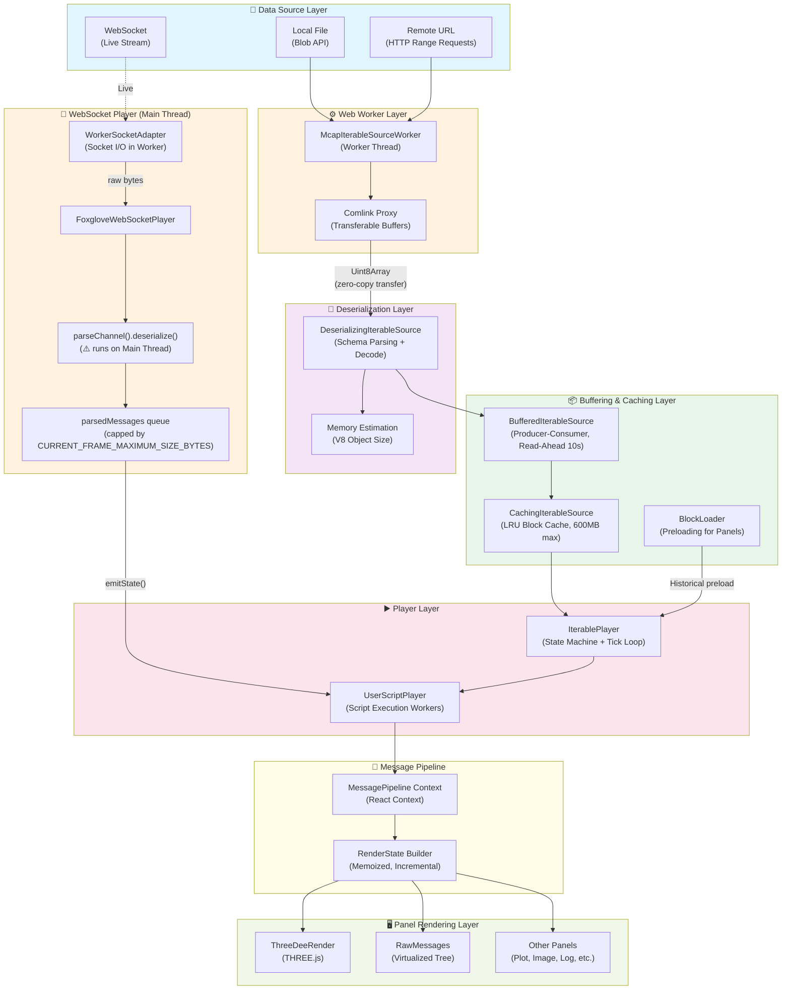

### Critical Performance Points (per layer)

| Layer           | Main Problem                        | Impact                |
| --------------- | ----------------------------------- | --------------------- |
| Data Source     | Disk / network I/O                  | Open and read latency |
| Worker          | Cross-thread communication overhead | Transfer latency      |
| Deserialization | CPU-bound (schema parsing)          | Playback jank         |
| Buffering/Cache | Memory pressure                     | OOM, tab crash        |
| Player          | Tick overflow (too many msgs/tick)  | Choppy playback       |
| Rendering       | GPU/CPU bound (point clouds, 3D)    | Low FPS               |
| Panels (React)  | Unnecessary re-renders              | UI lag                |
| User Scripts    | Per-message execution               | Cumulative delay      |

---

## 2. Connection Types (Data Sources)

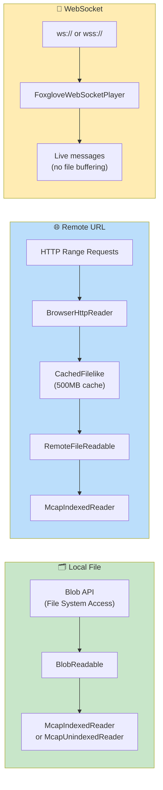

### Performance Comparison by Connection Type

| Aspect              | Local File            | Remote URL                       | WebSocket                      |
| ------------------- | --------------------- | -------------------------------- | ------------------------------ |
| **Initial latency** | Low (local I/O)       | Medium-High (index download)     | Low (handshake)                |
| **Throughput**      | High (SSD/NVMe)       | Limited by network               | Limited by network + publisher |
| **Seek**            | Fast (indexed)        | Medium (range requests + cache)  | N/A (live only)                |
| **Memory**          | Worker buffer + cache | HTTP cache 500MB + Worker buffer | Live message buffer            |
| **40GB scenario**   | ✅ Viable (indexed)   | ⚠️ High seek latency             | ❌ N/A                         |
| **Back-pressure**   | Controlled by player  | Controlled by player             | ⚠️ Can accumulate              |

### Data Source Factories

```
McapLocalDataSourceFactory      → IterablePlayer (readAhead: 120s)
RemoteDataSourceFactory         → IterablePlayer (readAhead: default)
Ros1LocalBagDataSourceFactory   → IterablePlayer
Ros2LocalBagDataSourceFactory   → IterablePlayer
FoxgloveWebSocketDataSourceFactory → FoxgloveWebSocketPlayer (live)
RosbridgeDataSourceFactory      → FoxgloveWebSocketPlayer (live)
```

### 2.1 WebSocket — Buffering, Accumulation, and Panel Data Lifecycle

Unlike the file-based pipeline (which has centralized caching via `CachingIterableSource` 600MB LRU and `BufferedIterableSource` 120s read-ahead), the WebSocket path has **no centralized historical cache**. Instead, buffering and data accumulation happen at two distinct layers:

#### Layer 1: Player-Level — `parsedMessages` Queue (Transient)

The `FoxgloveWebSocketPlayer` accumulates deserialized messages in a `parsedMessages[]` array between debounced `emitState()` calls. This is a **transient buffer**, not a cache — messages are drained on each emit and cannot be recovered.

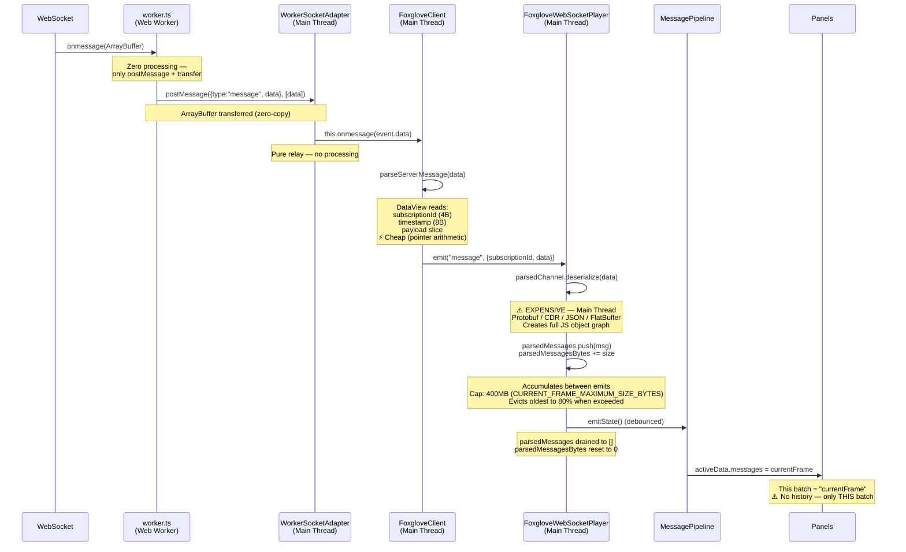

**Key behaviors:**
- **Deserialization on Main Thread:** Both ws-protocol framing (`parseServerMessage`) and schema deserialization (`parsedChannel.deserialize`) run on the main thread. The Worker only handles raw socket I/O
- **Debounced emit:** Multiple messages accumulate into a single batch before `emitState()` fires
- **Drain on emit:** `parsedMessages` is reset to `[]` — no historical retention at the player level
- **Tab throttling:** When the tab is inactive, `setTimeout` is throttled to ~1/sec, causing rapid message accumulation
- **Eviction:** When `parsedMessagesBytes > 400MB`, oldest messages are spliced out until size drops to 80% (320MB)
- **No `allFrames`:** WebSocket player does NOT provide `progress.messageCache.blocks` — panels cannot request historical data from the player

#### Layer 2: Panel-Level — Per-Panel Data Accumulation

Since the WebSocket player provides no historical data, each panel that needs history must **accumulate its own data** from successive `currentFrame` batches.

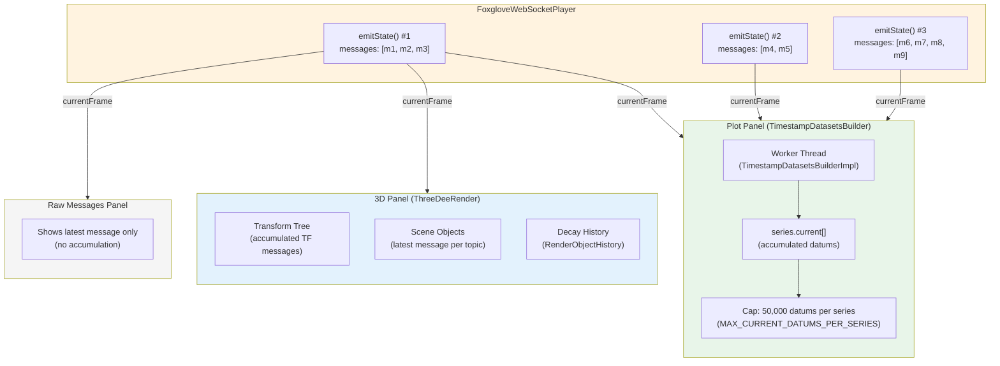

#### How Each Panel Handles WebSocket Data

| Panel                  | Accumulation Strategy                                                     | Data Retention                     | Memory Growth         |
| ---------------------- | ------------------------------------------------------------------------- | ---------------------------------- | --------------------- |
| **Plot**               | `append-current` action → Worker accumulates datums in `series.current[]` | 50,000 datums/series (then culled) | Bounded (Worker heap) |
| **3D (ThreeDee)**      | Latest message per topic; transform tree grows; decay keeps history       | Unbounded TF tree + decay limit    | Can grow significantly |
| **Raw Messages**       | Shows latest message only, no history                                     | 1 message                          | Minimal               |
| **Image**              | Shows latest image, no history                                            | 1 decoded image                    | Minimal               |
| **Log**                | Appends log entries to virtualized list                                   | Configurable buffer                | Moderate              |
| **State Transitions**  | Accumulates state history                                                 | Session duration                   | Can grow              |

#### Deep Dive: Plot Panel with WebSocket Data

The Plot panel is the best example of panel-level accumulation. It uses a dedicated Worker to accumulate and downsample data:

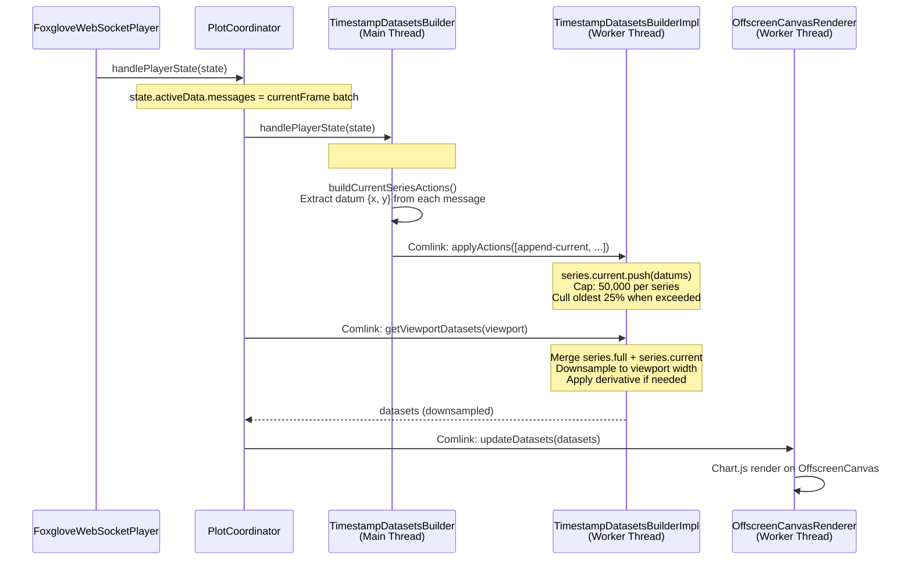

**Key distinction — `series.full[]` vs `series.current[]`:**

| Property          | `series.full[]`                                             | `series.current[]`                                         |
| ----------------- | ----------------------------------------------------------- | ---------------------------------------------------------- |
| **Populated by**  | `handleMessageRange()` via `unstable_subscribeMessageRange` | `handlePlayerState()` via `currentFrame`                   |
| **Data source**   | File-based range source (preloaded history)                 | Live `currentFrame` batches                                |
| **WebSocket**     | **Empty** — no range source available                       | **Only data source** — all accumulated datums              |
| **Cap**           | No cap (bounded by file size)                               | 50,000 datums per series (`MAX_CURRENT_DATUMS_PER_SERIES`) |
| **On seek (file)**| Reloaded from range source                                  | Reset to `[]`                                              |
| **On seek (WS)**  | N/A                                                         | **Kept** — data cannot be reloaded                         |

**`#hasRangeSource` flag controls the flow:**
- When `false` (WebSocket): every `handlePlayerState()` call extracts data points from `currentFrame` → dispatched as `append-current` to Worker → Worker accumulates in `series.current[]`
- When `true` (file/MCAP): `handleMessageRange()` provides full history via `append-full` → `series.full[]`; `currentFrame` is skipped

**Overflow handling:** When `series.current[]` exceeds 50,000 datums, the oldest 25% + excess are culled via `splice(0, cullSize + 12,500)`, creating a sliding window effect.

#### Comparison: File vs WebSocket — Buffering Architecture

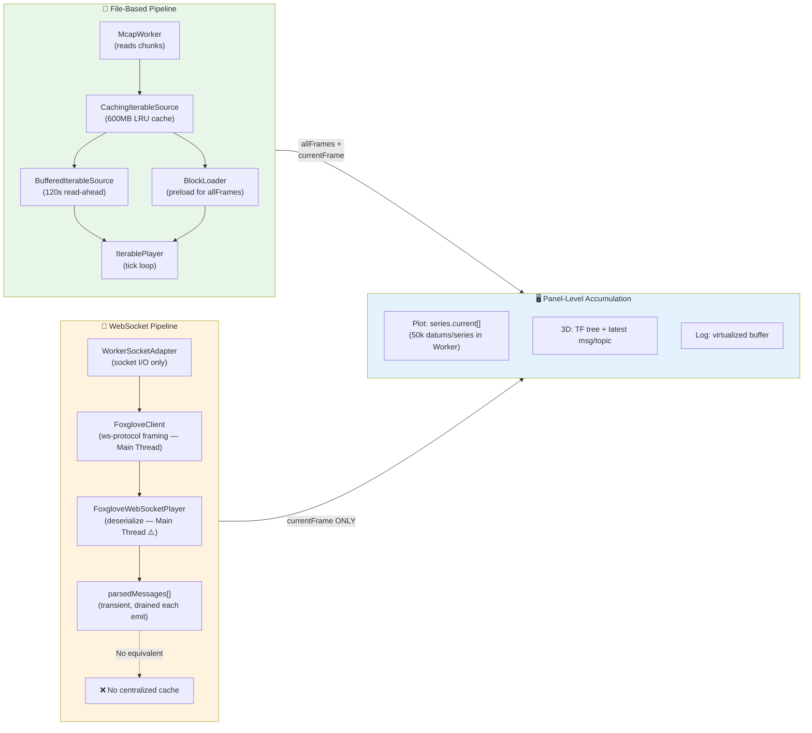

#### Critical Numbers — WebSocket Buffering

| Constant                           | Value           | Location                               |
| ---------------------------------- | --------------- | -------------------------------------- |
| `CURRENT_FRAME_MAXIMUM_SIZE_BYTES` | 400MB           | `FoxgloveWebSocketPlayer/constants.ts` |
| Eviction target                    | 80% (320MB)     | `FoxgloveWebSocketPlayer/index.ts`     |
| `MAX_CURRENT_DATUMS_PER_SERIES`    | 50,000          | `TimestampDatasetsBuilderImpl.ts`      |
| Cull overshoot                     | 25% extra       | `TimestampDatasetsBuilderImpl.ts`      |
| `emitState()` debounce             | Promise-based   | `FoxgloveWebSocketPlayer/index.ts`     |
| `allFrames` support                | ❌ Not available | WebSocket player has no `messageCache` |

#### Performance Implications — WebSocket vs File

| Aspect                         | File-Based                                   | WebSocket                                     |
| ------------------------------ | -------------------------------------------- | --------------------------------------------- |
| **Historical data**            | Full history via `allFrames` + `BlockLoader`  | None — panels accumulate from `currentFrame`  |
| **Seek**                       | Random access via chunk index                | N/A (live only)                               |
| **Memory management**          | Centralized (CachingIterableSource 600MB)    | Distributed (each panel manages own)          |
| **Memory pressure visibility** | Single cache size to monitor                 | Harder to track — spread across panels        |
| **Plot full history**          | `series.full[]` from range source            | `series.current[]` only (50k cap)             |
| **Data loss on tab inactive**  | None (reads from file on demand)             | Messages dropped if > 400MB queue             |
| **GC pressure**                | Batch-based (17ms tick windows)              | Continuous (each WS message creates objects)  |
| **Deserialization thread**     | Worker thread (via Comlink)                  | ⚠️ Main thread (blocks UI)                    |

---

## 3. MCAP — Structure and Reading

### 3.1 MCAP File Format Structure

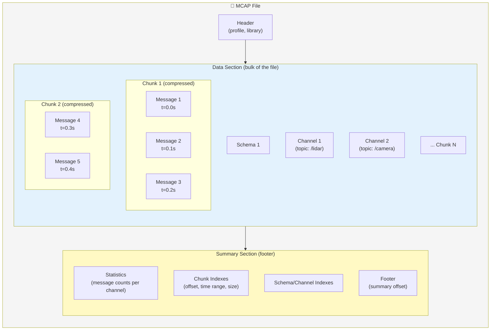

### 3.2 Indexed vs Unindexed

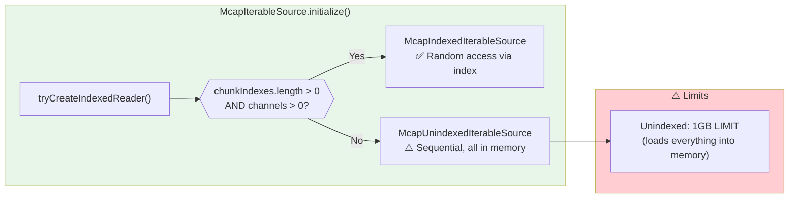

### 3.3 Performance Impact — Massive MCAP Data

#### Scenario: 40GB MCAP

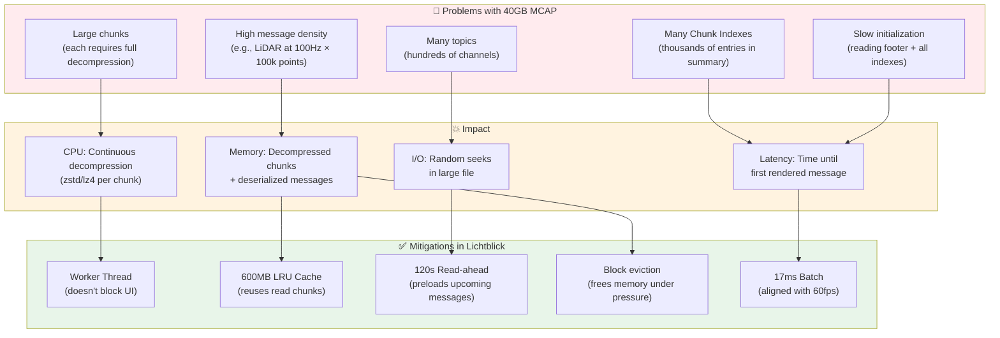

#### Factors That Scale the Problem

| Factor              | Typical Value | Problematic Value   | Why it's a problem                |
| ------------------- | ------------- | ------------------- | --------------------------------- |
| File size           | 1-5 GB        | 40+ GB              | More chunks to index, more I/O    |
| Number of topics    | 10-30         | 200+                | More channels to filter per chunk |
| Msgs/second (total) | 1000          | 50,000+             | More messages per tick window     |
| Average msg size    | 1 KB          | 1 MB (point clouds) | Memory pressure in buffer         |
| Recording duration  | 5 min         | 2+ hours            | More preload blocks               |
| Chunk size          | 4 MB          | 64 MB               | Heavier decompression             |

---

## 4. Worker and Deserialization

### 4.1 Worker Architecture (Comlink)

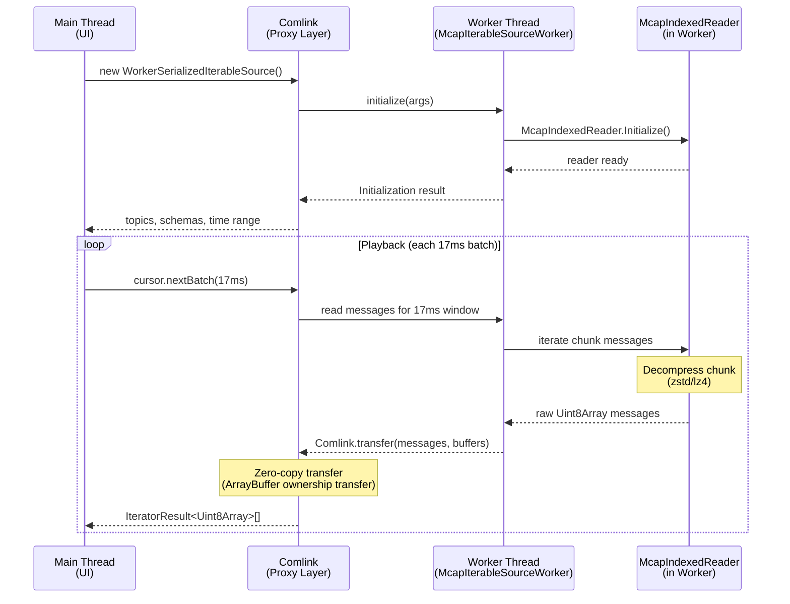

### 4.2 Deserialization Pipeline

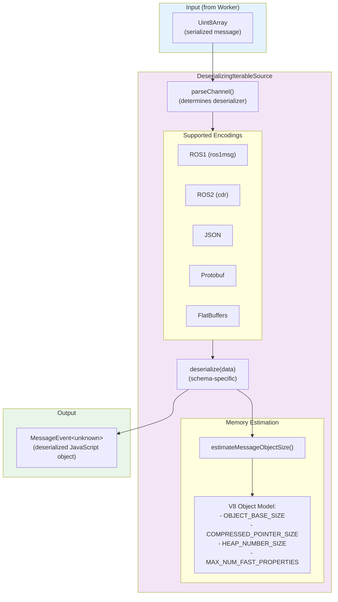

### 4.3 Deserialization Performance

**Problem:** With 50,000 messages/second, deserialization is CPU-bound.

**Specific bottlenecks:**

- **Protobuf/CDR with complex schemas:** Deep nested objects require many allocations
- **Point Clouds (ROS):** `sensor_msgs/PointCloud2` has binary data that needs field-by-field interpretation
- **Large strings:** JSON serialization/deserialization with large payloads

**Implemented optimizations:**

1. Worker thread separates deserialization from UI
2. Transferable buffers avoid binary data copying
3. 17ms batching limits volume per frame
4. Memory estimation enables monitoring memory pressure

---

## 5. Caching and Buffering

### 5.1 Layered Cache Architecture

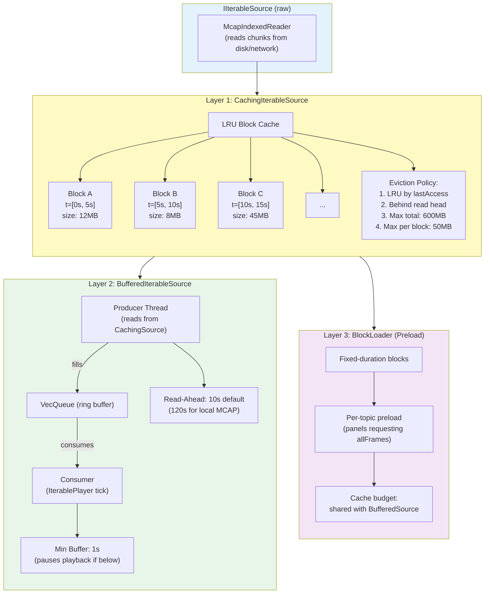

### 5.2 Cache Decision Flow

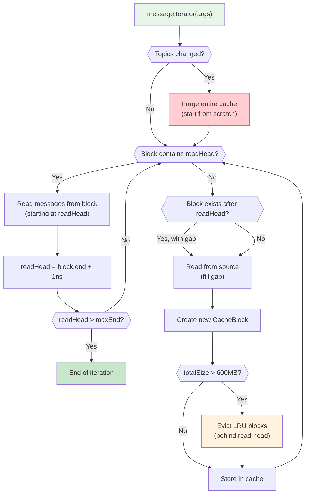

### 5.3 Critical Numbers (from code)

| Constant                            | Value               | File                                |
| ----------------------------------- | ------------------- | ----------------------------------- |
| `maxTotalSizeBytes`                 | 629,145,600 (600MB) | `CachingIterableSource.ts`          |
| `maxBlockSizeBytes`                 | 52,428,800 (50MB)   | `CachingIterableSource.ts`          |
| `DEFAULT_READ_AHEAD_DURATION`       | 10 seconds          | `BufferedIterableSource.ts`         |
| `MIN_READ_AHEAD_DURATION`           | 1 second            | `BufferedIterableSource.ts`         |
| `readAheadDuration` (local MCAP)    | 120 seconds         | `McapLocalDataSourceFactory.ts`     |
| `DEFAULT_CACHE_SIZE_BYTES` (remote) | 524,288,000 (500MB) | `RemoteFileReadable.ts`             |
| Batch size (worker)                 | 17ms                | `WorkerSerializedIterableSource.ts` |

### 5.4 Browser Memory Limit — The 4GB Ceiling (OOM)

Chromium-based browsers impose a hard limit of ~4GB for the V8 heap per renderer process. Lichtblick web operates within this constraint, and with massive MCAPs the sum of all memory layers can easily reach this ceiling, causing **tab crash (OOM)**.

#### Memory Consumers in the Browser

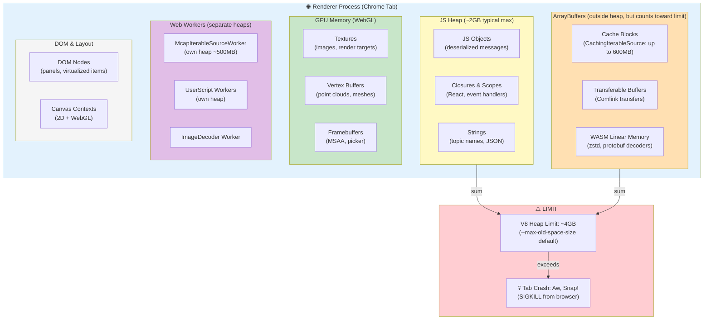

> **Note:** Workers have separate V8 heaps (~4GB each), but when buffers are **transferred** (Comlink.transfer) ownership passes to the receiver — and counts toward the receiver's heap.

#### Memory Consumption — Normal vs Problematic Scenario

| Component                                 | Normal Scenario (5GB MCAP, 30 topics) | Problematic Scenario (40GB MCAP, 200+ topics, point clouds) |
| ----------------------------------------- | ------------------------------------- | ----------------------------------------------------------- |
| Cache blocks (CachingIterableSource)      | ~200MB                                | ~600MB (cap reached)                                        |
| Deserialized messages in memory           | ~100MB                                | ~400MB+                                                     |
| BlockLoader (preload allFrames)           | ~50MB                                 | ~300MB+                                                     |
| WebGL buffers (3D panel)                  | ~50MB                                 | ~500MB+ (multiple point clouds with decay)                  |
| React component tree + DOM                | ~30MB                                 | ~80MB                                                       |
| WASM heaps (decoders)                     | ~20MB                                 | ~50MB                                                       |
| V8 overhead (GC metadata, hidden classes) | ~50MB                                 | ~150MB                                                      |
| **TOTAL**                                 | **~500MB**                            | **~2.1GB+**                                                 |

#### Multiplier Effect — How It Reaches Crash

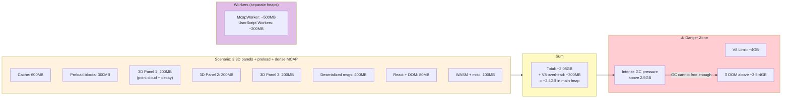

#### Desktop (Electron) vs Web — Memory Limits

| Aspect                     | Desktop (Electron)                                           | Web (Chrome/Firefox)             |
| -------------------------- | ------------------------------------------------------------ | -------------------------------- |
| **V8 Limit**               | Configurable via `--max-old-space-size`                      | ~4GB (browser hard limit)        |
| **Total available memory** | System memory (8-64GB+)                                      | Shared across all tabs           |
| **Renderer process**       | Dedicated process                                            | Shared with extensions, DevTools |
| **ArrayBuffers**           | Can exceed heap (mmap)                                       | Count toward process limit       |
| **Crash behavior**         | Can use swap, degrades gracefully                            | Immediate tab kill (OOM killer)  |
| **Possible mitigation**    | `app.commandLine.appendSwitch('max-old-space-size', '8192')` | None (browser limit)             |
| **40GB MCAP scenario**     | ✅ Works with proper configuration                           | ⚠️ High OOM risk                 |

#### Mitigation Strategies

```mermaid
flowchart TB
    subgraph Current["✅ Current Mitigations"]
        M1["600MB cache cap<br/>(CachingIterableSource)"]
        M2["LRU block eviction<br/>(frees old blocks)"]
        M3["50MB max block size<br/>(limits individual blocks)"]
        M4["Worker offloading<br/>(reduces main heap pressure)"]
        M5["Transferable buffers<br/>(avoids duplication)"]
    end

    subgraph Possible["💡 Possible Improvements"]
        P1["Adaptive cache sizing<br/>(reduce cache if performance.memory<br/>indicates pressure)"]
        P2["Memory pressure API<br/>(navigator.deviceMemory +<br/>performance.measureUserAgentSpecificMemory)"]
        P3["Streaming deserialization<br/>(don't keep all msgs in memory)"]
        P4["Aggressive point cloud LOD<br/>(reduce points under memory pressure)"]
        P5["Shared ArrayBuffer<br/>(avoid transfers between threads)"]
        P6["Offscreen Canvas<br/>(move rendering to Worker)"]
        P7["WASM point cloud processing<br/>(⚠️ low boundary cost — see 5.5)"]
        P8["WASM image decoding<br/>(⚠️ low boundary cost — see 5.5)"]
        P9["WASM deserialization<br/>(⚠️ high boundary cost — see 5.5)"]
        P10["Point Cloud → Worker<br/>(see 5.6 #1)"]
        P11["WS Deserialization → Worker<br/>(see 5.6 #2)"]
        P12["THREE.js → OffscreenCanvas<br/>(see 5.6 #3)"]
    end

    subgraph Monitor["📊 Monitoring APIs"]
        API1["performance.memory<br/>(Chrome only, deprecated)"]
        API2["performance.measureUserAgentSpecificMemory()<br/>(Cross-origin isolated)"]
        API3["navigator.deviceMemory<br/>(total device memory)"]
    end

    Current --> Monitor
    Monitor --> Possible

    style Current fill:#e8f5e9
    style Possible fill:#fff9c4
    style Monitor fill:#e3f2fd
```

#### Typical Memory Distribution in Problematic Scenario

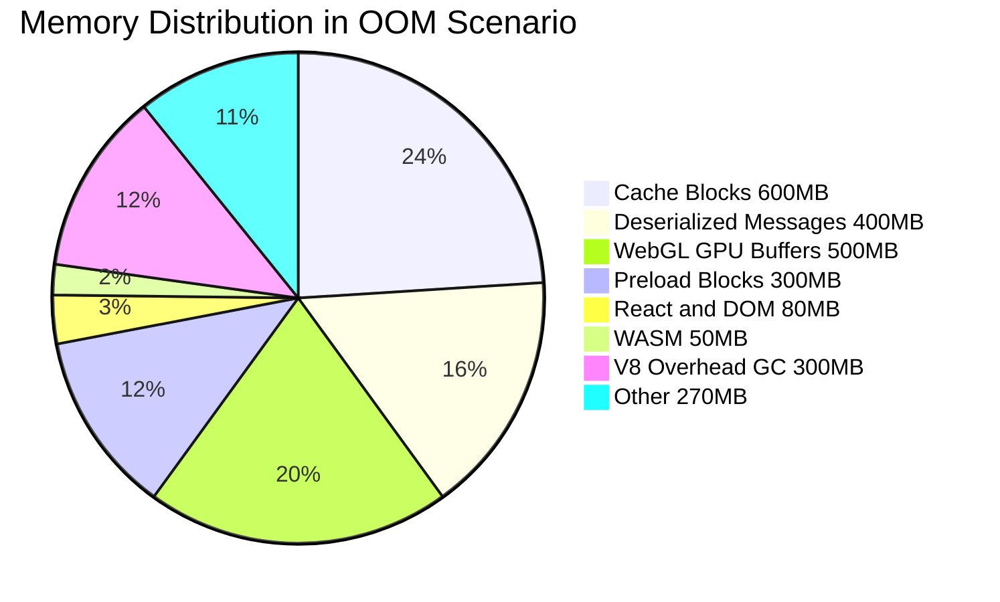

#### Key Points About the 4GB Limit

1. **The limit is per renderer process**, not per tab (although generally 1 tab = 1 process)
2. **Transferred ArrayBuffers** count toward the receiver's heap — Comlink's zero-copy transfers ownership, it doesn't eliminate consumption
3. **GC becomes inefficient** above ~2.5GB — longer GC pauses cause jank even before OOM
4. **The browser kills the tab without warning** — there's no possible `try/catch` for OOM
5. **Multiple 3D panels** multiply GPU memory consumption which also pressures the process
6. **Electron (desktop)** doesn't suffer from this limit because it can be configured with a larger `--max-old-space-size`

### 5.5 WebAssembly — Performance Acceleration

WebAssembly (WASM) enables near-native execution speed for CPU-bound tasks inside the browser. Lichtblick already uses WASM for chunk decompression, and has **three additional WASM modules built but not yet integrated** into the main pipeline.

#### 5.5.1 Current WASM Usage in the Pipeline

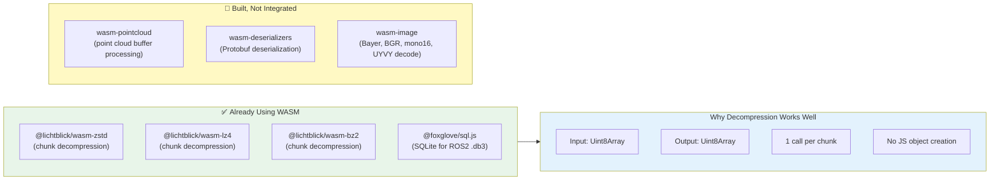

Decompression is an **ideal WASM use case**: binary in, binary out, no JS object conversion needed. The three unintegrated modules have varying suitability depending on their boundary crossing profile.

#### 5.5.2 The JS↔WASM Boundary Cost — When WASM Hurts

> **Critical tradeoff:** In scenarios with high-frequency conversion between JS and WASM, the boundary crossing overhead can **degrade performance worse than pure JS**.

Every WASM function call crosses an ABI boundary:

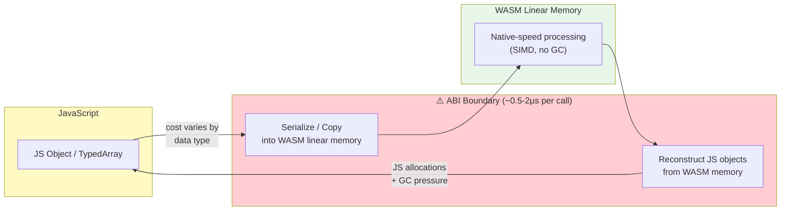

**Concrete impact at scale:**

```
50,000 messages/sec × 1μs boundary overhead per call
= 50ms/sec of pure overhead
= ~3 frames lost at 60fps — JUST from boundary crossing
```

**When WASM helps:**

| Condition                       | Why                                            | Example                                                   |
| ------------------------------- | ---------------------------------------------- | --------------------------------------------------------- |
| Large contiguous binary buffers | Amortized boundary cost per byte is negligible | Point cloud: 100k points × 32 bytes = 3.2MB per call      |
| Output is a TypedArray          | Zero-copy via shared WASM memory view          | `Float32Array` position buffer, `Uint8Array` color buffer |
| Few calls with big payloads     | Low total boundary overhead                    | 1 call/frame for point cloud, 1 call/image                |
| Tight numeric loops             | SIMD + predictable memory access               | Field reading, color conversion                           |

**When WASM hurts:**

| Condition                           | Why                                                          | Example                                                    |
| ----------------------------------- | ------------------------------------------------------------ | ---------------------------------------------------------- |
| Many small calls                    | Boundary cost dominates processing time                      | 50k deserialize() calls/sec for small messages             |
| Output must be JS object graph      | Must reconstruct objects in JS heap — GC pressure returns    | Deserialized Protobuf → `{sec: number, nsec: number, ...}` |
| Simple processing per call          | JS JIT is already fast enough, WASM overhead is net negative | `JSON.parse()` for small payloads                          |
| High call frequency + small payload | Per-call overhead × frequency > processing savings           | Simple ROS1 `string` messages at 100Hz                     |

#### 5.5.3 Top 3 WASM Integration Points — Ranked by Net Impact

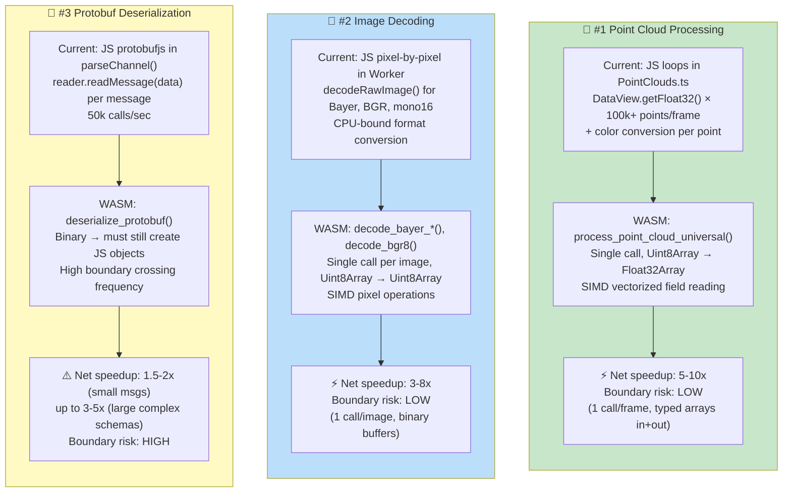

##### #1 Point Cloud Processing (`wasm-pointcloud`)

**Where it fits in the pipeline:**

```
PointCloud2 message (Uint8Array)
  → [WASM] process_point_cloud_universal()
  → positions: Float32Array(N×3)  ← zero-copy view on WASM memory
  → colors: Uint8Array(N×4)       ← zero-copy view on WASM memory
  → GPU upload (gl.bufferData)
```

| Aspect            | Current (JS)                                   | With WASM                                         |
| ----------------- | ---------------------------------------------- | ------------------------------------------------- |
| Processing        | `DataView.getFloat32()` per-point per-field    | SIMD-vectorized batch read                        |
| Color conversion  | JS `getColorConverter()` per-point             | Lookup table in WASM linear memory                |
| GC pressure       | Temp objects per-point (`tempColor`, closures) | Zero — all in linear memory                       |
| Calls per frame   | N/A (inline loops)                             | 1 call to `process_point_cloud_universal()`       |
| Output            | Writes to `Float32Array` attribute buffers     | Returns `Float32Array` / `Uint8Array` — same type |
| **Boundary cost** | N/A                                            | **~2μs total** (1 call, large buffer)             |

**This is the highest-impact integration** because:

- It runs on the **main thread** every frame at 60fps
- The inner loop is the tightest hot path in the entire application
- Input and output are both typed arrays — **ideal WASM boundary profile**
- The `wasm-pointcloud` module already has `process_point_cloud_universal()` that handles all color modes + stixels in a single call

##### #2 Image Decoding (`wasm-image`)

**Where it fits in the pipeline:**

```
RawImage / CompressedImage (Uint8Array)
  → [Worker] WorkerImageDecoder.worker.ts
    → [WASM] decode_bayer_bggr8() / decode_bgr8() / decode_mono16() / ...
    → ImageData (Uint8ClampedArray)
  → [Comlink.transfer] back to main thread
  → GPU texture upload
```

| Aspect            | Current (JS)                        | With WASM                             |
| ----------------- | ----------------------------------- | ------------------------------------- |
| Bayer demosaicing | Pixel-by-pixel interpolation in JS  | SIMD bilinear interpolation           |
| BGR→RGBA          | Loop with per-pixel channel swap    | Batch 4-byte operations               |
| mono16 scaling    | JS `DataView.getUint16()` per pixel | Direct memory access + SIMD           |
| **Boundary cost** | N/A                                 | **~1μs** (1 call, large image buffer) |

**Good boundary profile** because: already runs in a Worker, 1 call per image, large binary buffers in and out. The `wasm-image` module supports all ROS image encodings (Bayer BGGR8/GBRG8/GRBG8/RGGB8, BGR8, BGRA8, RGB8, RGBA8, mono8, mono16, float1c, UYVY, YUYV).

##### #3 Protobuf/CDR Deserialization (`wasm-deserializers`)

**Where it fits in the pipeline:**

```
Uint8Array (serialized protobuf)
  → [WASM] deserialize_protobuf(schema, type, data)
  → ⚠️ JS object graph (allocations + GC pressure)
  → MessageEvent<unknown>
  → React panels consume as JS objects
```

| Aspect             | Current (JS `protobufjs`)             | With WASM                           |
| ------------------ | ------------------------------------- | ----------------------------------- |
| Binary parsing     | JS-based field-by-field decode        | Native-speed binary parsing         |
| Object creation    | Direct JS object construction         | Must cross boundary → JS allocation |
| Schema compilation | JS `protobufjs.Root.fromDescriptor()` | Rust prost schema compilation       |
| Calls per second   | 50,000+                               | 50,000+ (**each crosses boundary**) |
| **Boundary cost**  | N/A                                   | **~50ms/sec** at 50k msgs/sec × 1μs |

> **⚠️ Caution:** For small/simple messages (e.g., `std_msgs/String`, `geometry_msgs/Pose`), the JS→WASM→JS boundary overhead can **negate or exceed** the raw processing speedup. The net gain is primarily for **large, deeply nested schemas** like `sensor_msgs/PointCloud2` or complex Protobuf messages with many fields.

**Recommendation:** Use WASM deserialization selectively — apply it for schemas above a complexity/size threshold, keep JS `protobufjs` for simple messages.

#### 5.5.4 Decision Matrix — When to Apply WASM

| Criterion             | Use WASM                                       | Keep JS                                |
| --------------------- | ---------------------------------------------- | -------------------------------------- |
| Message size          | > 10KB per message                             | < 1KB per message                      |
| Call frequency        | < 1000 calls/sec (or 1 call/frame)             | > 10,000 calls/sec                     |
| Output type           | TypedArray (`Float32Array`, `Uint8Array`)      | JS object graph                        |
| Processing complexity | Tight numeric loop, SIMD-friendly              | Simple field access, string operations |
| Data characteristics  | Contiguous binary buffer                       | Sparse/structured data                 |
| Already in Worker?    | Yes — WASM in Worker avoids main thread impact | No — WASM on main thread still blocks  |

#### 5.5.5 WASM Tradeoffs and Risks

| Tradeoff                 | Description                                                                                                                  |
| ------------------------ | ---------------------------------------------------------------------------------------------------------------------------- |
| **Initialization cost**  | WASM modules must be fetched, compiled, and instantiated (~50-200ms). Must be done once and cached.                          |
| **Debugging complexity** | WASM stack traces are opaque. Source maps for Rust→WASM exist but are less mature than JS debugging.                         |
| **WASM linear memory**   | WASM memory (`WebAssembly.Memory`) counts toward the renderer process memory limit — it does **not** bypass the 4GB ceiling. |
| **Bundle size**          | Each `.wasm` binary adds to the application bundle (~50-500KB per module, compressed).                                       |
| **Maintenance burden**   | Requires Rust toolchain (`wasm-pack`, `wasm-bindgen`) in addition to the JS/TS build pipeline.                               |
| **JS↔WASM boundary**    | The overhead per call is small (~1μs), but at high call frequencies it accumulates significantly.                            |

#### 5.5.6 Future Path — WASM + Worker Combined Pipeline

```mermaid
flowchart LR
    subgraph Current["Current Pipeline"]
        direction TB
        C1["Worker: WASM decompresses chunk"] -->|"Uint8Array"| C2["Worker: JS extracts messages"]
        C2 -->|"Comlink.transfer"| C3["Main: JS deserializes"]
        C3 -->|"JS objects"| C4["Main: JS processes point cloud"]
        C4 -->|"Float32Array"| C5["GPU upload"]
    end

    subgraph Future["Optimized Pipeline"]
        direction TB
        F1["Worker: WASM decompresses +<br/>extracts messages in one call"] -->|"Uint8Array"| F2["Worker: WASM deserializes<br/>(stays in WASM memory)"]
        F2 -->|"Comlink.transfer"| F3["Main: WASM processes point cloud<br/>(binary → Float32Array directly)"]
        F3 -->|"Float32Array"| F4["GPU upload"]
    end

    style Current fill:#fff3e0
    style Future fill:#e8f5e9
```

The key insight is to **keep data in WASM memory as long as possible**, minimizing the number of JS↔WASM boundary crossings. In the future pipeline:

- Decompression + message extraction happen in a single WASM call (avoids 1 boundary)
- Deserialized data stays as binary in WASM memory (avoids creating JS objects)
- Point cloud processing reads directly from WASM memory (avoids another boundary)
- Only the final `Float32Array` crosses back to JS for GPU upload

This reduces boundary crossings from **4 per message** to **1 per frame**.

### 5.6 Web Worker Offloading — Additional Opportunities

While Lichtblick already offloads several CPU-intensive operations to Web Workers (MCAP reading, image decoding, Plot dataset building, user scripts), there are still **critical main-thread bottlenecks** that could be moved to Workers for significant performance gains.

#### 5.6.1 Current Worker Usage

```mermaid
flowchart LR
    subgraph Already["✅ Already in Workers"]
        direction TB
        W1["McapIterableSourceWorker<br/>(MCAP reading + decompression)"]
        W2["WorkerSocketAdapter<br/>(WebSocket I/O only)"]
        W3["WorkerImageDecoder<br/>(image format conversion)"]
        W4["TimestampDatasetsBuilder<br/>(Plot dataset accumulation)"]
        W5["CustomDatasetsBuilder<br/>(Plot X/Y building)"]
        W6["OffscreenCanvasRenderer<br/>(Chart.js on OffscreenCanvas)"]
        W7["UserScript Workers<br/>(script execution)"]
    end

    subgraph StillMain["⚠️ Still on Main Thread"]
        direction TB
        M1["Point Cloud buffer processing<br/>(100k+ points/frame)"]
        M2["WebSocket deserialization<br/>(50k msgs/sec)"]
        M3["THREE.js rendering<br/>(full scene every frame)"]
        M4["Transform tree lookups<br/>(per renderable per frame)"]
        M5["Message conversion<br/>(renderState per frame)"]
    end

    style Already fill:#e8f5e9
    style StillMain fill:#ffcdd2
```

#### 5.6.2 Top 3 Worker Offloading Opportunities — Ranked by Impact

##### #1 Point Cloud Buffer Processing → Dedicated Worker

**Current:** `PointClouds.ts` → `#updatePointCloudBuffers()` runs **every frame at 60fps** on the main thread. It iterates 100k+ points using `DataView.getFloat32()` per-field, computes color conversion, and writes to `Float32Array`/`Uint8Array` geometry buffers.

**Impact:** This is the **single heaviest CPU operation** on the main thread per frame. With multiple point cloud topics or decay enabled, it can consume 10-30ms per frame — more than the entire 16.6ms frame budget.

**Proposed:** Move point cloud buffer processing to a dedicated Worker. The Worker receives the raw `Uint8Array` message data + field descriptors + color settings, produces typed arrays, and transfers them back via `Comlink.transfer()`. The main thread only does `gl.bufferData()` upload.

```mermaid
sequenceDiagram
    participant Main as Main Thread
    participant Worker as PointCloud Worker
    participant GPU as WebGL

    Main->>Worker: Comlink.transfer(PointCloud2 Uint8Array,<br/>field offsets, color mode)
    Note over Worker: Process 100k+ points<br/>(tight loops, SIMD-friendly)
    Worker-->>Main: Comlink.transfer(Float32Array positions,<br/>Uint8Array colors)
    Main->>GPU: gl.bufferData(positions)
    Main->>GPU: gl.bufferData(colors)
    Note over Main: Total main thread cost:<br/>~1ms (buffer upload only)
```

| Metric                     | Current (Main Thread) | With Worker                    |
| -------------------------- | --------------------- | ------------------------------ |
| Main thread time per frame | 10-30ms (100k points) | ~1ms (buffer upload only)      |
| Frame budget consumed      | 60-180%               | ~6%                            |
| Multiple point clouds      | Compounds linearly    | Parallel in Worker             |
| Latency introduced         | None                  | 1 frame (~16ms, imperceptible) |
| Existing pattern           | —                     | Same as Plot's Comlink Workers |
| Compatibility              | —                     | Needs async pipeline           |

**Files affected:** `PointClouds.ts`, `pointExtensionUtils.ts`, `fieldReaders.ts`

**Risk:** Introduces 1-frame latency between receiving the message and seeing it rendered. At 60fps this is 16ms — imperceptible to users.

---

##### #2 WebSocket Message Deserialization → Worker

**Current:** `FoxgloveWebSocketPlayer` calls `chanInfo.parsedChannel.deserialize(data)` on the **main thread** for every live message (line 530 of `FoxgloveWebSocketPlayer/index.ts`). At 50k msgs/sec, this is CPU-bound deserialization competing with rendering.

**Impact:** For live connections with high-frequency topics (LiDAR at 100Hz, IMU at 1kHz), deserialization can consume 5-15ms per emit cycle, causing jank.

**Proposed:** Move deserialization into the existing `WorkerSocketAdapter` Worker (which currently only handles socket I/O). The Worker would deserialize messages using `parseChannel()` and transfer the results back.

```mermaid
flowchart TB
    subgraph Current["Current Architecture"]
        direction LR
        CW["WorkerSocketAdapter<br/>(I/O only)"] -->|"raw bytes"| CM["Main Thread:<br/>parseChannel().deserialize()"]
        CM --> CP["parsedMessages queue"]
    end

    subgraph Proposed["Proposed Architecture"]
        direction LR
        PW["WorkerSocketAdapter<br/>(I/O + deserialization)"] -->|"Comlink.transfer<br/>(deserialized messages)"| PM["Main Thread:<br/>ready to use"]
        PM --> PP["parsedMessages queue"]
    end

    style Current fill:#fff3e0
    style Proposed fill:#e8f5e9
```

| Metric                    | Current (Main Thread) | With Worker                            |
| ------------------------- | --------------------- | -------------------------------------- |
| Main thread CPU per msg   | ~0.5-2ms (complex)    | ~0 (transfer only)                     |
| Jank with LiDAR @ 100Hz   | Frequent (5-15ms)     | None (Worker absorbs)                  |
| Back-pressure handling    | None (accumulates)    | Worker can drop/sample                 |
| Transfer overhead         | —                     | Structured clone for JS objects        |
| Binary field optimization | —                     | `Uint8Array` fields transfer zero-copy |

**Files affected:** `FoxgloveWebSocketPlayer/index.ts`, `WorkerSocketAdapter.ts`

**Risk:** Deserialized JS objects require structured cloning (not transferable). However, for binary-heavy messages (e.g., `PointCloud2`), the large `data` field is a `Uint8Array` that CAN be transferred zero-copy — only small headers need cloning.

---

##### #3 THREE.js 3D Rendering → OffscreenCanvas Worker

**Current:** The entire THREE.js render pipeline (scene traversal, frustum culling, draw calls, GPU synchronization) runs on the **main thread** in `Renderer.ts`. This includes transform tree lookups (`updatePose` per renderable per frame), raycasting, and multi-pass rendering (main + picker).

**Impact:** With complex scenes (point clouds + meshes + transforms + multiple render passes), rendering consumes 8-20ms per frame. Combined with React reconciliation, this pushes total frame time well over the 16.6ms budget.

**Proposed:** Use `OffscreenCanvas` to move the entire THREE.js render loop to a Worker — exactly as the Plot panel already does with Chart.js via `OffscreenCanvasRenderer`. The main thread only sends scene updates; the Worker owns the canvas.

```mermaid
flowchart LR
    subgraph MainThread["Main Thread (React + Pipeline)"]
        direction TB
        MT1["MessagePipeline<br/>(message delivery)"]
        MT2["React UI<br/>(settings, interactions)"]
        MT3["Camera state<br/>(orbit controls)"]
    end

    subgraph WorkerThread["Worker (OffscreenCanvas)"]
        direction TB
        WT1["THREE.js Renderer"]
        WT2["Transform Tree<br/>(updatePose per renderable)"]
        WT3["Scene Graph<br/>(all renderables)"]
        WT4["WebGL Context<br/>(draw calls)"]
        WT5["Raycasting<br/>(hover/click picking)"]
    end

    MT1 -->|"message batches<br/>(Comlink.transfer)"| WT3
    MT2 -->|"settings changes"| WT1
    MT3 -->|"camera matrix"| WT1
    WT5 -->|"pick results"| MT2

    style MainThread fill:#e3f2fd
    style WorkerThread fill:#e8f5e9
```

| Metric                  | Current (Main Thread) | With OffscreenCanvas Worker          |
| ----------------------- | --------------------- | ------------------------------------ |
| Main thread render time | 8-20ms/frame          | ~0 (handled in Worker)               |
| React responsiveness    | Blocked during render | Fully responsive                     |
| FPS independence        | Rendering blocks UI   | Worker renders at own pace           |
| Transform tree cost     | Per-renderable/frame  | Runs in Worker, unblocks main        |
| Event handling          | Direct                | Round-trip via messages              |
| Existing pattern        | —                     | Plot panel's OffscreenCanvasRenderer |

**Files affected:** `Renderer.ts`, `SceneExtension.ts`, `updatePose.ts`, all renderables

**Risk:** This is the **highest complexity** change:

- All scene state must be synchronized between threads via messages
- Mouse/keyboard events require round-trips (adds input latency)
- Settings changes need structured message passing
- THREE.js supports `OffscreenCanvas` natively, but the integration requires significant refactoring
- The Plot panel's `OffscreenCanvasRenderer` proves the pattern is viable in this codebase

---

#### 5.6.3 Summary — Impact vs Complexity

```mermaid
quadrantChart
    title Worker Offloading: Impact vs Complexity
    x-axis "Low Complexity" --> "High Complexity"
    y-axis "Low Impact" --> "High Impact"
    quadrant-1 "High Impact, High Complexity"
    quadrant-2 "High Impact, Low Complexity"
    quadrant-3 "Low Impact, Low Complexity"
    quadrant-4 "Low Impact, High Complexity"
    "Point Cloud → Worker": [0.3, 0.9]
    "WS Deserialization → Worker": [0.45, 0.7]
    "THREE.js → OffscreenCanvas": [0.85, 0.85]
```

| Rank | Candidate                   | Main Thread Savings | Complexity | Existing Pattern in Codebase    |
| ---- | --------------------------- | ------------------- | ---------- | ------------------------------- |
| 🥇 1 | Point Cloud → Worker        | 10-30ms/frame       | **Low**    | Plot uses same Comlink pattern  |
| 🥈 2 | WS Deserialization → Worker | 5-15ms/emit         | **Medium** | File pipeline already does this |
| 🥉 3 | THREE.js → OffscreenCanvas  | 8-20ms/frame        | **High**   | Plot's OffscreenCanvasRenderer  |

**Combined effect of #1 + #2:** Removes 15-45ms of CPU work per frame from the main thread — enough to maintain 60fps even with dense point clouds over live WebSocket connections.

#### 5.6.4 Worker Offloading vs WASM — Complementary Strategies

These approaches are **not mutually exclusive**. The optimal architecture combines both:

```mermaid
flowchart LR
    subgraph Optimal["🏆 Optimal: Worker + WASM Combined"]
        direction TB
        Step1["Worker receives PointCloud2 Uint8Array"]
        Step2["WASM processes point cloud<br/>(SIMD, zero-GC, in Worker heap)"]
        Step3["Worker transfers Float32Array to main"]
        Step4["Main: gl.bufferData() only (~1ms)"]

        Step1 --> Step2 --> Step3 --> Step4
    end

    subgraph Benefits["Benefits"]
        B1["Main thread: free for React + UI"]
        B2["Worker thread: native-speed WASM"]
        B3["No GC pressure on main heap"]
        B4["Zero-copy between WASM and Worker"]
    end

    Optimal --> Benefits

    style Optimal fill:#e8f5e9
    style Benefits fill:#e3f2fd
```

| Strategy          | What it solves                    | Best for                           |
| ----------------- | --------------------------------- | ---------------------------------- |
| **Worker only**   | Frees main thread from CPU work   | Any CPU-bound task                 |
| **WASM only**     | Executes faster than JS           | Tight numeric loops on main thread |
| **Worker + WASM** | Frees main thread AND runs faster | Point clouds, image decoding       |

---

## 6. Player — Tick Loop and State

### 6.1 State Machine

```mermaid
stateDiagram-v2
    [*] --> preinit
    preinit --> initialize: setListener()
    initialize --> start_play: source initialized
    start_play --> idle: emit initial state

    idle --> play: play()
    idle --> seek_backfill: seek()
    idle --> close: close()

    play --> idle: pause / end of data
    play --> seek_backfill: seek while playing
    play --> reset_playback_iterator: topics changed
    play --> close: close()

    seek_backfill --> idle: backfill complete
    seek_backfill --> play: backfill + resume

    reset_playback_iterator --> play: iterator reset

    close --> [*]
```

### 6.2 Tick Loop — Read Algorithm

```mermaid
flowchart TB
    TickStart["tick() called"] --> IsPlaying{{"isPlaying?"}}
    IsPlaying -->|"No"| Return["return (no-op)"]
    IsPlaying -->|"Yes"| CalcDuration["Calculate durationMillis:<br/>tickTime - lastTickMillis<br/>(default: 20ms if first tick)"]

    CalcDuration --> CalcRange["rangeMillis = min(duration × speed, 300ms)<br/>Smoothing: 0.9 × lastRange + 0.1 × newRange"]

    CalcRange --> CalcEnd["targetTime = currentTime + rangeMillis<br/>end = clamp(targetTime, start, untilTime)"]

    CalcEnd --> CheckLastStamp{{"lastStamp > end?"}}
    CheckLastStamp -->|"Yes"| ShortCircuit["Skip read:<br/>currentTime = end<br/>messages = []<br/>emit state"]
    CheckLastStamp -->|"No"| ReadLoop["Loop: read from iterator"]

    ReadLoop --> ReadMsg["msg = iterator.next()"]
    ReadMsg --> CheckMsg{{"msg.timestamp <= end?"}}
    CheckMsg -->|"Yes"| AddMsg["msgEvents.push(msg)<br/>receivedBytes += msg.size"]
    AddMsg --> ReadMsg
    CheckMsg -->|"No"| SaveStamp["lastStamp = msg.timestamp<br/>(reused in next tick)"]

    SaveStamp --> Emit["currentTime = end<br/>messages = msgEvents<br/>queueEmitState()"]
    ShortCircuit --> Emit

    style TickStart fill:#e8f5e9
    style CalcRange fill:#fff9c4
    style ShortCircuit fill:#e3f2fd
    style Emit fill:#f3e5f5
```

### 6.3 Tick Loop Performance

**Key problem:** With many messages in a short period, a single tick can process thousands of messages.

**Protection mechanisms:**

1. **300ms cap:** Never reads more than 300ms of data per tick (even at high speed)
2. **EMA Smoothing:** Smooths variations between ticks (prevents oscillations)
3. **Short-circuit via lastStamp:** If the next message is after tick end, skips reading
4. **Sampling (DeserializingIterableSource):** `setSamplingWindowEnd()` allows limiting the window

**Problematic scenario:**

```
MCAP with LiDAR at 100Hz, each msg = 1MB
→ In 300ms tick: 30 messages × 1MB = 30MB of deserialized data per tick
→ At 60fps: 30MB × 60 = 1.8GB/s throughput required
```

---

## 7. 3D Rendering

### 7.1 ThreeDeeRender Pipeline

```mermaid
flowchart TB
    subgraph Input["Data Input"]
        CurrentFrame["currentFrame<br/>(current tick messages)"]
        AllFrames["allFrames<br/>(preloaded transforms)"]
    end

    subgraph Renderer["Renderer (THREE.js)"]
        direction TB

        subgraph Extensions["Scene Extensions"]
            PointClouds["PointClouds"]
            Images["Images"]
            Markers["Markers"]
            FrameAxes["FrameAxes<br/>(Transform Tree)"]
            LaserScans["LaserScans"]
            SceneEntities["SceneEntities"]
        end

        subgraph Processing["Per-Frame Processing"]
            AddMessage["addMessageEvent()<br/>(dispatch by schema)"]
            UpdatePose["updatePose()<br/>(Transform lookup)"]
            UpdateGeom["Update Geometry<br/>(DynamicBufferGeometry)"]
        end

        subgraph RenderLoop["Render Loop"]
            Scene["THREE.Scene"]
            Camera["Camera State"]
            WebGL["WebGLRenderer<br/>(MSAA, LOD)"]
            Picker["Picker<br/>(selection/hover)"]
        end
    end

    subgraph Output["Output"]
        Canvas["HTMLCanvasElement<br/>(GPU rendered)"]
    end

    CurrentFrame --> AddMessage
    AllFrames --> FrameAxes
    AddMessage --> Extensions
    Extensions --> UpdatePose
    UpdatePose --> UpdateGeom
    UpdateGeom --> Scene
    Scene --> WebGL
    Camera --> WebGL
    WebGL --> Canvas
    Picker --> WebGL

    style Input fill:#e3f2fd
    style Renderer fill:#fff3e0
    style Output fill:#e8f5e9
```

### 7.2 Point Clouds — The Heaviest Case

```mermaid
flowchart TB
    subgraph Message["PointCloud2 Message"]
        Fields["fields: [x, y, z, intensity, rgb]"]
        Data["data: Uint8Array (N × point_step bytes)"]
        Width["width × height points"]
    end

    subgraph Processing["Processing"]
        FieldReaders["FieldReaders<br/>(getReader per field type)"]
        ColorConvert["Color Conversion<br/>(gradient/colormap/rgb/rgba)"]

        subgraph Geometry["DynamicBufferGeometry"]
            PosAttr["position: Float32Array(N×3)"]
            ColAttr["color: Uint8Array(N×4)"]
        end

        Upload["GPU Upload<br/>(gl.bufferData)"]
    end

    subgraph Render["Rendering"]
        Material["THREE.PointsMaterial<br/>(size, shape, sizeAttenuation)"]
        Points["THREE.Points<br/>(frustumCulled: false)"]
        Draw["Draw Call<br/>(GL_POINTS)"]
    end

    Message --> FieldReaders
    FieldReaders --> Geometry
    ColorConvert --> ColAttr
    Geometry --> Upload
    Upload --> Points
    Material --> Points
    Points --> Draw

    style Message fill:#e3f2fd
    style Processing fill:#fff9c4
    style Render fill:#e8f5e9
```

### 7.3 3D Performance Problems

| Problem                 | Cause                                   | Impact                         | Mitigation                                    |
| ----------------------- | --------------------------------------- | ------------------------------ | --------------------------------------------- |
| **Giant point clouds**  | 100k+ points per frame, multiple clouds | GPU memory + draw calls        | `DynamicBufferGeometry` (reuses buffers), LOD |
| **Deep transform tree** | Hundreds of TF frames                   | CPU per message (lookup chain) | `MAX_TRANSFORM_MESSAGES` limit, preloading    |
| **Decay/History**       | `decayTime > 0` keeps history           | Memory accumulates geometries  | `RenderObjectHistory` with limit              |
| **Image decoding**      | Large images (1920×1080+)               | CPU on main thread             | `WorkerImageDecoder` (offload)                |
| **Shader compilation**  | Many different materials                | Stutter on first render        | Shader key caching (patched THREE.js)         |
| **Object picking**      | Raycasting on many objects              | CPU spike on hover/click       | `HOVER_PICK_THROTTLE_MS`, layer-based         |

### 7.4 Level of Detail (LOD)

```typescript
// packages/suite-base/src/panels/ThreeDeeRender/lod.ts
enum DetailLevel {
  Low,
  Medium,
  High,
}
// msaaSamples varies by level: Low=0, Medium=2, High=4
```

---

## 8. React Panels and Virtualization

### 8.1 PanelExtensionAdapter — Render State

```mermaid
flowchart TB
    subgraph Pipeline["MessagePipeline"]
        PlayerState["playerState<br/>(activeData, progress, etc.)"]
        CurrentFrame["currentFrame<br/>(tick messages)"]
        Blocks["messageBlocks<br/>(preloaded data)"]
    end

    subgraph Adapter["PanelExtensionAdapter"]
        WatchedFields["watchedFields<br/>(Set: 'currentFrame', 'topics', etc.)"]
        BuildRenderState["buildRenderState()<br/>(memoized builder)"]

        subgraph Checks["Dirty Checks"]
            TopicChange["topics !== prevTopics?"]
            FrameChange["currentFrame !== prevFrame?"]
            VarChange["variables !== prevVariables?"]
            ParamChange["parameters !== prevParams?"]
        end

        ShouldRender{{"shouldRender.value?"}}
    end

    subgraph Panel["Panel"]
        OnRender["onRender(renderState)"]
        PanelUI["UI Update"]
    end

    PlayerState --> BuildRenderState
    CurrentFrame --> BuildRenderState
    WatchedFields --> Checks
    Checks --> ShouldRender
    ShouldRender -->|"Yes"| OnRender
    ShouldRender -->|"No"| Skip["Skip render"]
    OnRender --> PanelUI

    style Pipeline fill:#e3f2fd
    style Adapter fill:#fff9c4
    style Panel fill:#e8f5e9
```

**Key optimization:** `buildRenderState()` uses `memoizeWeak` and per-field dirty-checking. Panels that don't subscribe to `currentFrame` don't receive message data — saving significant processing.

### 8.2 Raw Messages — Virtualization

```mermaid
flowchart TB
    subgraph Data["Message Data"]
        MsgObj["JavaScript Object<br/>(can have thousands of fields)"]
    end

    subgraph Processing["Processing"]
        Flatten["flattenTreeData()<br/>(generates flat list of visible nodes)"]
        ExpandSet["expandedNodes: Set&lt;string&gt;<br/>(controls visibility)"]
    end

    subgraph Virtualization["@tanstack/react-virtual"]
        Virtualizer["useVirtualizer()<br/>- estimateSize: fontSize<br/>- overscan: 5 items<br/>- measureElement: getBoundingClientRect"]
        VirtualItems["getVirtualItems()<br/>(only nodes visible in viewport)"]
    end

    subgraph Render["Rendering"]
        Container["Container div<br/>(height: totalSize)"]
        Rows["Only ~20-30 rows rendered<br/>(translateY for position)"]
    end

    MsgObj --> Flatten
    ExpandSet --> Flatten
    Flatten --> Virtualizer
    Virtualizer --> VirtualItems
    VirtualItems --> Rows
    Rows --> Container

    style Data fill:#e3f2fd
    style Processing fill:#f3e5f5
    style Virtualization fill:#fff9c4
    style Render fill:#e8f5e9
```

**Problem without virtualization:** A `PointCloud2` message with 100k points expanded would create 100,000+ DOM nodes → browser freezes.

**With virtualization:** Only ~30 nodes are rendered, regardless of data size.

### 8.3 React Performance Patterns in Lichtblick

| Pattern                   | Where it's used          | Problem it solves                    |
| ------------------------- | ------------------------ | ------------------------------------ |
| `useMemo` / `useCallback` | All panels               | Avoids recalculations on each render |
| `memo()` (React.memo)     | `VirtualizedTree`        | Avoids re-rendering the entire tree  |
| `useLatest` (react-use)   | Config refs              | Avoids panel re-creation             |
| `useDebouncedCallback`    | Settings/Config save     | Avoids excessive saves               |
| `watchedFields`           | Panel render state       | Filters irrelevant data              |
| `memoizeWeak`             | renderState builder      | Cache with GC-friendly keys          |
| `pauseFrame`              | Panel lifecycle          | Synchronizes renders with pipeline   |
| Virtualization            | RawMessages, large lists | Renders only what's visible          |

---

## 9. User Scripts

### 9.1 Execution Architecture

```mermaid
flowchart TB
    subgraph UserCode["User Code"]
        TSSource["TypeScript Source<br/>(panel editor)"]
    end

    subgraph TransformerWorker["Transformer Worker"]
        Compile["TypeScript Compiler<br/>(in-browser)"]
        TypeGen["generateTypesLib()<br/>(generates types from schemas)"]
        Validate["AST Validation<br/>(errors before execution)"]
        JSOutput["JavaScript Output"]
    end

    subgraph RuntimeWorker["Runtime Worker(s)"]
        Registry["Script Registry"]
        Execute["Execute per message:<br/>output = script(input)"]
        NewTopics["Produces new topics<br/>(virtual)"]
    end

    subgraph Player["UserScriptPlayer"]
        Wrap["Wraps IterablePlayer"]
        Inject["Injects produced messages<br/>into data pipeline"]
    end

    TSSource --> Compile
    Compile --> TypeGen
    TypeGen --> Validate
    Validate --> JSOutput
    JSOutput --> Registry
    Registry --> Execute
    Execute --> NewTopics
    NewTopics --> Inject
    Inject --> Player

    style UserCode fill:#e3f2fd
    style TransformerWorker fill:#fff9c4
    style RuntimeWorker fill:#fff3e0
    style Player fill:#e8f5e9
```

### 9.2 User Script Performance

**Execution model:** For EACH message on the subscribed topic, the script executes once.

**Problematic scenario:**

```
Topic /lidar at 100Hz → 100 executions/second of the script
If the script takes 5ms per execution → 500ms/s spent on scripts
→ No time left for rendering!
```

**Performance factors:**
| Factor | Impact | Recommendation |
|--------|--------|----------------|
| Script complexity | Proportional to time per msg | Keep scripts simple |
| Input topic frequency | Linear with number of executions | Prefer low-frequency topics |
| Output size | Memory + serialization | Minimize produced data |
| TypeScript compilation | Latency on first execution | Cache compiled JS |
| Allocations in script | GC pressure | Reuse objects when possible |

---

## 9B. Extensions — Performance Risks and Mitigations

Extensions are a powerful customization mechanism in Lichtblick, allowing users to register custom panels, message converters, topic alias functions, and camera models. However, **extensions run unsandboxed on the main thread** and have significant potential to degrade application performance.

### 9B.1 Extension Execution Model

```mermaid
flowchart TB
    subgraph Loading["📦 Extension Loading (once)"]
        direction TB
        L1["IExtensionLoader.loadExtension(id)"]
        L2["new Function('module', 'require', source)<br/>⚠️ eval-like, NO sandbox"]
        L3["module.exports.activate(ctx)"]
        L4["Register: panels, converters,<br/>topic aliases, camera models"]
        L1 --> L2 --> L3 --> L4
    end

    subgraph Runtime["⚡ Runtime Execution (per frame)"]
        direction TB
        subgraph PanelExt["Extension Panel"]
            P1["onRender(renderState, done)<br/>called every frame at 60fps"]
            P2["Panel DOM manipulation<br/>(direct access to panelElement)"]
        end

        subgraph ConverterExt["Message Converter"]
            C1["converter(msg, event, vars, ctx)<br/>called per message per frame"]
            C2["Synchronous, blocks main thread"]
            C3["Output feeds into panel rendering"]
        end

        subgraph AliasExt["Topic Alias Function"]
            A1["aliasFunction({topics, vars})<br/>called on every state change"]
        end

        subgraph CameraExt["Camera Model"]
            CM1["modelBuilder(cameraInfo)<br/>called during 3D rendering"]
        end
    end

    Loading --> Runtime

    style Loading fill:#e3f2fd
    style Runtime fill:#ffcdd2
    style PanelExt fill:#fff9c4
    style ConverterExt fill:#ffcdd2
    style AliasExt fill:#fff3e0
    style CameraExt fill:#f3e5f5
```

**Key code path** — Extension code is loaded via `new Function()` in `buildContributionPoints.ts`:

```typescript
// packages/suite-base/src/providers/helpers/buildContributionPoints.ts
const fn = new Function("module", "require", unwrappedExtensionSource);
fn(module, require, {});
const wrappedExtensionModule = module.exports as ExtensionModule;
wrappedExtensionModule.activate(ctx);
```

There is no iframe, Web Worker, or any sandboxing mechanism. Extension code runs **directly on the main thread** with full access to the JavaScript environment.

### 9B.2 Extension Types and Performance Impact

| Extension Type        | When it Runs                           | Frequency                             | Blocks Main Thread          | Risk Level |
| --------------------- | -------------------------------------- | ------------------------------------- | --------------------------- | ---------- |
| **Panel**             | `onRender()` callback                  | Every frame (60fps)                   | Yes (until `done()` called) | 🔴 High    |
| **Message Converter** | `converter()` per message              | Per message × per topic × per frame   | Yes (synchronous)           | 🔴 High    |
| **Topic Alias**       | On player state change / topic change  | On each `emitState()`                 | Yes (synchronous)           | 🟡 Medium  |
| **Camera Model**      | During 3D panel rendering              | Per camera per frame                  | Yes (synchronous)           | 🟡 Medium  |

### 9B.3 How Extensions Can Degrade Performance

#### A. Message Converters — The Biggest Risk

Message converters are the most dangerous performance vector because they execute **synchronously, per message, on the main thread**, with no timeout or CPU budget.

```mermaid
sequenceDiagram
    participant Pipeline as MessagePipeline
    participant RenderState as buildRenderState()
    participant Converter as Extension Converter
    participant Panel as Panel onRender

    Pipeline->>RenderState: New frame (N messages)
    loop For each message in currentFrame
        RenderState->>Converter: converter(msg, event, vars)
        Note over Converter: ⚠️ NO timeout<br/>⚠️ NO CPU budget<br/>⚠️ Blocks main thread
        Converter-->>RenderState: converted message
    end
    RenderState->>Panel: renderState with converted messages
    Panel-->>Pipeline: done()
```

**Problematic scenario:**

```
Extension registers converter: sensor_msgs/PointCloud2 → CustomViz
Topic /lidar at 100Hz (100 messages/sec)
Converter does: deep clone + field computation + JSON.stringify

If converter takes 5ms per message:
→ 100 msgs/sec × 5ms = 500ms/sec spent ONLY in converter
→ Only 500ms remaining for everything else (rendering, React, other panels)
→ At 60fps (16.6ms budget): converter alone takes 30% of EVERY frame
```

**Current protection** — only catches thrown exceptions, NOT performance issues:

```typescript
// messageProcessing.ts — convertMessage()
try {
  const convertedMessage = converter.converter(msg, event, globalVariables, context);
} catch (e) {
  // Only catches exceptions — an infinite loop will freeze the app FOREVER
  emitAlert({ severity: "error", message: "Uncaught error in message converter" });
}
```

#### B. Panel Extensions — Blocking the Frame Pipeline

Panel `onRender()` callbacks receive a `done` callback that must be called when rendering completes. The `pauseFrame` mechanism blocks the **entire message pipeline** until all panels call `done()`.

```mermaid
flowchart TB
    subgraph FrameCycle["Frame Cycle"]
        direction TB
        Emit["Player emitState()"]
        Pause["pauseFrame() — waits for ALL panels"]
        Render1["Panel A: onRender → done() ✅ (2ms)"]
        Render2["Panel B: onRender → done() ✅ (5ms)"]
        Render3["Extension Panel: onRender → ⏳ (200ms)"]
        Timeout["MAX_PROMISE_TIMEOUT_TIME_MS = 5000ms<br/>⚠️ Pipeline stalled for up to 5 seconds!"]
        Resume["Pipeline resumes"]

        Emit --> Pause
        Pause --> Render1
        Pause --> Render2
        Pause --> Render3
        Render3 -->|"Slow extension"| Timeout
        Timeout --> Resume
    end

    style FrameCycle fill:#fff3e0
    style Timeout fill:#ffcdd2
```

**Current safeguards:**
- `MAX_PROMISE_TIMEOUT_TIME_MS = 5000ms` — after 5 seconds the pipeline continues without the panel
- `slowRender` flag — sets an orange border on panels that can't keep up (visual only)
- Error boundary — catches `throw` in render, shows error UI

**What's NOT protected:**
- Synchronous blocking in `onRender` before calling `done()` — no way to interrupt
- Heavy DOM manipulation that triggers forced layout/reflow
- Infinite loops (freeze entire application with no recovery)

#### C. Extension-Triggered Over-Subscription

Extensions can subscribe to **any number of topics** with `preload: true`, forcing the application to deserialize and cache all messages for those topics.

```typescript
// A poorly-written extension that subscribes to everything
context.subscribe(
  topics.map(t => ({ topic: t.name, preload: true }))
);
```

**Impact:** Forces `allFrames` processing for ALL topics → massive memory consumption + CPU load from iterating all preload blocks per frame.

#### D. Memory Leaks from Extensions

Extensions have direct access to the DOM (`panelElement`) and can create event listeners, closures, timers, and objects that persist beyond the panel lifecycle if not cleaned up properly.

```typescript
// Extension that leaks — no cleanup on unmount
initPanel(context) {
  const data = [];  // grows unbounded
  context.onRender = (state, done) => {
    data.push(...state.currentFrame);  // never cleared!
    done();
  };
  // Missing: return () => { /* cleanup */ }
}
```

### 9B.4 Current Safeguards — Summary

| Safeguard                               | What it Protects                | Limitation                                                       |
| --------------------------------------- | ------------------------------- | ---------------------------------------------------------------- |
| `try/catch` on `converter()`            | Catches thrown exceptions       | Does NOT protect against infinite loops or slow code              |
| `MAX_PROMISE_TIMEOUT_TIME_MS` (5000ms)  | Prevents permanent pipeline stall | 5 seconds is far too long — causes massive perceived lag        |
| `slowRender` indicator (orange border)  | Visual feedback to user         | Purely informational, no throttling or disabling                  |
| Error boundary                          | Catches panel render crashes    | Does NOT handle OOM or frozen panels                             |
| `sampling: "latest-per-render-tick"`    | Reduces message delivery freq   | Only if converter explicitly opts in (`supportsLatestPerRenderTick`) |
| Error alert system                      | Notifies user of converter errors | No automatic disabling of problematic extensions                |

### 9B.5 Proposed Mitigations

```mermaid
flowchart TB
    subgraph ShortTerm["🟢 Short-Term (Low Complexity)"]
        S1["Converter time tracking<br/>(performance.now() before/after)"]
        S2["Auto-disable slow converter<br/>(after N budget violations)"]
        S3["Subscription budget per extension<br/>(max topics, max preload)"]
        S4["Reduce pauseFrame timeout<br/>(5000ms → 500ms)"]
        S5["Warning UI for slow extensions<br/>(show ms/frame in panel toolbar)"]
    end

    subgraph MediumTerm["🟡 Medium-Term (Medium Complexity)"]
        M1["Message converter in Worker<br/>(isolate from main thread)"]
        M2["Converter result caching<br/>(skip re-conversion for same input)"]
        M3["Extension CPU budget<br/>(throttle if exceeding budget)"]
        M4["Lazy converter invocation<br/>(only convert when panel visible)"]
        M5["Extension profiling dashboard<br/>(per-extension metrics in UI)"]
    end

    subgraph LongTerm["🔴 Long-Term (High Complexity)"]
        L1["Extension sandboxing via iframe<br/>(full memory + CPU isolation)"]
        L2["Extension Workers<br/>(each extension in own Worker)"]
        L3["WASM-based extension runtime<br/>(deterministic execution, limits)"]
        L4["Extension review + certification<br/>(performance benchmarks)"]
    end

    style ShortTerm fill:#e8f5e9
    style MediumTerm fill:#fff9c4
    style LongTerm fill:#ffcdd2
```

#### Detailed Strategies

##### 1. Converter Time Tracking + Auto-Disable (Short-Term)

```typescript
// Proposed enhancement to convertMessage() in messageProcessing.ts
const start = performance.now();
const convertedMessage = converter.converter(msg, event, globalVariables, context);
const elapsed = performance.now() - start;

if (elapsed > CONVERTER_BUDGET_MS) {  // e.g., 2ms per message
  converterViolations.increment(converter.extensionId);
  if (converterViolations.get(converter.extensionId) > MAX_VIOLATIONS) {
    disableConverter(converter.extensionId);
    emitAlert({
      severity: "error",
      message: `Converter from ${converter.extensionId} auto-disabled: exceeded ${CONVERTER_BUDGET_MS}ms budget ${MAX_VIOLATIONS} times`,
    });
  }
}
```

**Limitation:** Cannot interrupt a synchronous converter mid-execution. Only detects and disables after repeated violations.

##### 2. Message Converter in Worker (Medium-Term)

Move converter execution to a dedicated Worker with timeout and kill capability:

```mermaid
sequenceDiagram
    participant Main as Main Thread
    participant Worker as Converter Worker
    participant Ext as Extension Converter Code

    Main->>Worker: Comlink: convertBatch(messages, converterCode)
    Worker->>Ext: converter(msg1)
    Ext-->>Worker: result1
    Worker->>Ext: converter(msg2)
    Ext-->>Worker: result2
    Worker-->>Main: Comlink.transfer(convertedMessages)

    Note over Main: If Worker takes > 16ms:
    Main->>Worker: terminate() + restart
    Main-->>Main: Skip conversion, show alert
```

**Advantages:**
- True isolation — a frozen converter doesn't block the main thread
- Can be killed and restarted (Worker termination is instant)
- CPU budget enforceable via Worker round-trip timing
- Follows existing pattern: Plot panel uses Comlink Workers for data processing

**Challenges:**
- Message data must be cloned/transferred to Worker (structured clone cost)
- Converter code must be serializable (no closures over panel state)
- Converter `context` (globalVariables, emitAlert) must be proxied across thread boundary

##### 3. Extension Subscription Budget (Short-Term)

| Budget Parameter              | Default Limit | Configurable |
| ----------------------------- | ------------- | ------------ |
| Max subscribed topics         | 20            | Yes          |
| Max preload topics            | 5             | Yes          |
| Max message rate per panel    | 1000 msgs/sec | Yes          |
| Max frame processing time     | 8ms (50%)     | No           |

##### 4. Extension Profiling Dashboard (Medium-Term)

| Metric                       | What it Measures                    | Warning Threshold |
| ---------------------------- | ----------------------------------- | ----------------- |
| `converter.avgMs`            | Average converter execution time    | > 1ms             |
| `panel.renderMs`             | Time in onRender per frame          | > 8ms             |
| `panel.skipCount`            | Frames where panel couldn't keep up | > 10%             |
| `extension.memoryDelta`      | Memory growth attributed to ext     | > 50MB            |
| `extension.subscriptionCount`| Number of topics subscribed         | > 20              |

### 9B.6 Architecture Comparison — Current vs Proposed

```mermaid
flowchart LR
    subgraph Current["Current: No Isolation"]
        direction TB
        MainThread1["Main Thread"]
        App1["Lichtblick Core"]
        Ext1["Extension A<br/>(converter)"]
        Ext2["Extension B<br/>(panel)"]
        Ext3["Extension C<br/>(converter)"]

        MainThread1 --> App1
        MainThread1 --> Ext1
        MainThread1 --> Ext2
        MainThread1 --> Ext3
    end

    subgraph Proposed["Proposed: Tiered Isolation"]
        direction TB
        MainThread2["Main Thread"]
        App2["Lichtblick Core"]
        PanelExt["Panel Extensions<br/>(main thread, budgeted)"]
        ConvWorker["Converter Worker<br/>(isolated, killable)"]
        AliasCalc["Alias Functions<br/>(main thread, cached)"]

        MainThread2 --> App2
        MainThread2 --> PanelExt
        ConvWorker -.->|"transfer results"| MainThread2
        MainThread2 --> AliasCalc
    end

    style Current fill:#ffcdd2
    style Proposed fill:#e8f5e9
```

### 9B.7 Key Takeaways

1. **Extensions run unsandboxed** — `new Function()` executes extension code directly on the main thread with full access to the JS environment
2. **Message converters are the highest risk** — they execute synchronously per-message with no timeout or budget, and a slow converter compounds linearly with topic frequency
3. **The 5-second `pauseFrame` timeout is too generous** — at 60fps, even 100ms of blocking causes visible jank; the timeout should be reduced to ~500ms
4. **No automatic disabling mechanism exists** — a misbehaving extension continues degrading performance until manually uninstalled
5. **Extension over-subscription** can force the pipeline to process far more data than necessary, contributing to memory pressure and OOM
6. **Worker isolation for converters** is the recommended medium-term strategy — it provides true CPU isolation with kill capability, follows the existing Comlink pattern in the codebase, and doesn't require changes to the extension API surface

---

## 10. Problem and Solution Matrix

### 10.1 Problems by Layer

```mermaid
flowchart LR
    subgraph Symptoms["🔴 Observable Symptoms"]
        S1["App freezes when opening file"]
        S2["Playback choppy / stuttering"]
        S3["Low FPS in 3D panel"]
        S4["Tab crash (OOM)"]
        S5["Slow seek"]
        S6["UI unresponsive"]
        S7["Delayed messages (live)"]
    end

    subgraph RootCauses["🟡 Root Causes"]
        C1["MCAP unindexed > 1GB"]
        C2["Too many msgs per tick window"]
        C3["Large point clouds"]
        C4["Cache exceeds available memory"]
        C5["Too many chunks to traverse"]
        C6["Heavy user script"]
        C7["WebSocket back-pressure"]
    end

    S1 --> C1
    S2 --> C2
    S3 --> C3
    S4 --> C4
    S5 --> C5
    S6 --> C6
    S7 --> C7

    style Symptoms fill:#ffcdd2
    style RootCauses fill:#fff9c4
```

### 10.2 Complete Diagnostic Table

| #   | Symptom                             | Layer        | Root Cause                                           | Diagnosis                                        | Existing Solution                            | Possible Improvement                                                                                               |
| --- | ----------------------------------- | ------------ | ---------------------------------------------------- | ------------------------------------------------ | -------------------------------------------- | ------------------------------------------------------------------------------------------------------------------ |
| 1   | App freezes when opening large MCAP | MCAP Reading | Unindexed file trying to load everything into memory | Check if MCAP has summary section                | 1GB limit for unindexed                      | Partial streaming for unindexed                                                                                    |
| 2   | Slow initialization (>10s)          | MCAP Reading | Too many chunk indexes to parse                      | Measure time in `McapIndexedReader.Initialize()` | Preload decompressHandlers                   | Index caching between sessions                                                                                     |
| 3   | Choppy playback                     | Player Tick  | Too many messages in 300ms tick window               | Count msgs/tick in debug                         | 300ms cap + EMA smoothing                    | Adaptive tick window, message sampling, WASM deserialization for complex schemas (⚠️ high boundary cost — see 5.5) |
| 4   | Stutter when starting play          | Buffering    | Empty buffer, waiting for min read-ahead (1s)        | Observe "buffering" state                        | Producer-consumer with condvar               | Predictive pre-buffering                                                                                           |
| 5   | OOM / tab crash                     | Caching      | Total cache > tab's available memory                 | Monitor `getCacheSize()`                         | 600MB cap + LRU eviction                     | Adaptive cache sizing based on `performance.memory`                                                                |
| 6   | Slow seek in large MCAP             | MCAP I/O     | Seek requires finding correct chunk + decompressing  | Measure time of `getBackfillMessages()`          | Cache reuses already-read blocks             | In-memory chunk index with binary search                                                                           |
| 7   | Low FPS in 3D                       | Rendering    | Point clouds with 500k+ points                       | GPU memory in DevTools                           | LOD, DynamicBufferGeometry                   | Octree culling, point budget, **WASM point cloud processing** (see 5.5), **Worker offloading** (see 5.6 #1)        |
| 8   | Low FPS with decay                  | Rendering    | History accumulates geometries                       | Count objects in scene                           | `RenderObjectHistory` with limit             | Instanced rendering for decay                                                                                      |
| 9   | Jank when expanding RawMessages     | Panel/React  | DOM explosion without virtualization                 | React DevTools profiler                          | VirtualizedTree with @tanstack/react-virtual | Lazy expansion (load on demand)                                                                                    |
| 10  | Delayed live messages               | WebSocket    | Publisher sends faster than UI processes             | Latency between publish and render               | No specific throttle                         | Message dropping / sampling, **WS deserialization → Worker** (see 5.6 #2)                                          |
| 11  | Script execution lag                | User Scripts | Script executes for each message                     | Measure time per execution in worker             | Worker isolation                             | Batch execution, throttle                                                                                          |
| 12  | Slow images                         | Rendering    | Large image decode on main thread                    | Performance profiler (decode time)               | `WorkerImageDecoder`                         | **WASM image decoder** (`wasm-image` — see 5.5), GPU decode                                                        |
| 13  | Memory grows continuously           | All          | Leaks in closures, event listeners, caches           | Heap snapshot comparison                         | N/A                                          | Periodic cache purge, WeakRef                                                                                      |
| 14  | Slow remote file seek               | Remote I/O   | HTTP range request + network latency                 | Network tab, cache hit ratio                     | 500MB CachedFilelike                         | Predictive prefetch                                                                                                |
| 15  | 3D panel blocks React UI            | Rendering    | THREE.js render loop on main thread (8-20ms/frame)   | Performance profiler (long tasks)                | None                                         | **THREE.js → OffscreenCanvas Worker** (see 5.6 #3)                                                                 |
| 16  | Live WS jank with many topics       | WebSocket    | `deserialize()` runs on main thread per message      | Profiler: `deserialize` in flame chart           | `WorkerSocketAdapter` (I/O only)             | **Move deserialization into Worker** (see 5.6 #2)                                                                  |
| 17  | Extension converter freezes UI      | Extensions   | Slow/infinite converter blocks main thread           | Profiler: long `convertMessage` task             | `try/catch` (exceptions only)                | **Converter time tracking + auto-disable** (see 9B.5 #1), **Converter Worker** (see 9B.5 #2)                       |
| 18  | Extension over-subscription         | Extensions   | Extension subscribes all topics with `preload: true` | Memory profiler: growing `allFrames`             | None                                         | **Subscription budget per extension** (see 9B.5 #3)                                                                |
| 19  | Slow extension panel blocks pipeline| Extensions   | Panel `onRender` takes >5s, stalls `pauseFrame`      | Pipeline freeze after frame delivery             | 5000ms timeout (too generous)                | **Reduce timeout to ~500ms**, auto-disable slow panels (see 9B.5)                                                  |

### 10.3 Prioritization by Impact

| Priority  | Issue                  | Impact      | Frequency   |
| --------- | ---------------------- | ----------- | ----------- |
| 🔴 High   | OOM / Tab Crash        | Very High   | High        |
| 🔴 High   | Choppy Playback        | High        | Very High   |
| 🔴 High   | Low 3D FPS             | High        | High        |
| 🟡 Medium | Slow Seek              | Medium-High | Medium      |
| 🟡 Medium | WebSocket backpressure | Medium      | Medium      |
| 🟡 Medium | Slow Init              | Medium      | Medium-Low  |
| 🟢 Low    | Script Lag             | Medium-Low  | Low         |
| 🟢 Low    | Image decode           | Low-Medium  | Medium-High |
| 🟢 Low    | RawMsg jank            | Low         | Medium      |
| 🟢 Low    | Remote seek            | Medium-Low  | Low         |
| 🔴 High   | Extension converter freeze | High    | Medium      |
| 🟡 Medium | Extension over-subscription | Medium | Medium-Low  |

---

## 11. Code References

### Critical Files by Layer

#### Data Sources

| File                                                                        | Responsibility                 |
| --------------------------------------------------------------------------- | ------------------------------ |
| `packages/suite-base/src/dataSources/McapLocalDataSourceFactory.ts`         | Player creation for local file |
| `packages/suite-base/src/dataSources/RemoteDataSourceFactory.tsx`           | Player creation for remote URL |
| `packages/suite-base/src/dataSources/FoxgloveWebSocketDataSourceFactory.ts` | WebSocket player creation      |

#### MCAP Reading

| File                                                                                     | Responsibility            |
| ---------------------------------------------------------------------------------------- | ------------------------- |
| `packages/suite-base/src/players/IterablePlayer/Mcap/McapIterableSource.ts`              | Entry point (file vs url) |
| `packages/suite-base/src/players/IterablePlayer/Mcap/McapIndexedIterableSource.ts`       | Indexed reading           |
| `packages/suite-base/src/players/IterablePlayer/Mcap/McapUnindexedIterableSource.ts`     | Sequential reading        |
| `packages/suite-base/src/players/IterablePlayer/Mcap/McapIterableSourceWorker.worker.ts` | Worker thread             |
| `packages/suite-base/src/players/IterablePlayer/Mcap/RemoteFileReadable.ts`              | HTTP range + cache        |
| `packages/suite-base/src/players/IterablePlayer/shared/MultiIterableSource.ts`           | Multiple files            |

#### Worker & Deserialization

| File                                                                                     | Responsibility              |
| ---------------------------------------------------------------------------------------- | --------------------------- |
| `packages/suite-base/src/players/IterablePlayer/WorkerSerializedIterableSource.ts`       | Comlink proxy (main thread) |
| `packages/suite-base/src/players/IterablePlayer/WorkerSerializedIterableSourceWorker.ts` | Comlink host (worker)       |
| `packages/suite-base/src/players/IterablePlayer/DeserializingIterableSource.ts`          | Deserialization pipeline    |
| `packages/suite-base/src/players/messageMemoryEstimation.ts`                             | V8 memory model             |

#### Buffering & Caching

| File                                                                       | Responsibility           |
| -------------------------------------------------------------------------- | ------------------------ |
| `packages/suite-base/src/players/IterablePlayer/BufferedIterableSource.ts` | Producer-consumer buffer |
| `packages/suite-base/src/players/IterablePlayer/CachingIterableSource.ts`  | LRU block cache          |
| `packages/suite-base/src/players/IterablePlayer/BlockLoader.ts`            | Block-based preloading   |

#### Player

| File                                                               | Responsibility            |
| ------------------------------------------------------------------ | ------------------------- |
| `packages/suite-base/src/players/IterablePlayer/IterablePlayer.ts` | State machine + tick loop |

#### User Scripts

| File                                                                          | Responsibility   |
| ----------------------------------------------------------------------------- | ---------------- |
| `packages/suite-base/src/players/UserScriptPlayer/index.ts`                   | Player wrapper   |
| `packages/suite-base/src/players/UserScriptPlayer/transformerWorker/index.ts` | TS compilation   |
| `packages/suite-base/src/players/UserScriptPlayer/runtimeWorker/index.ts`     | Script execution |

#### 3D Rendering

| File                                                                                     | Responsibility         |
| ---------------------------------------------------------------------------------------- | ---------------------- |
| `packages/suite-base/src/panels/ThreeDeeRender/ThreeDeeRender.tsx`                       | Panel component        |
| `packages/suite-base/src/panels/ThreeDeeRender/Renderer.ts`                              | THREE.js renderer core |
| `packages/suite-base/src/panels/ThreeDeeRender/renderables/PointClouds.ts`               | Point cloud rendering  |
| `packages/suite-base/src/panels/ThreeDeeRender/renderables/Images/WorkerImageDecoder.ts` | Image worker           |

#### Panel/React

| File                                                                                 | Responsibility       |
| ------------------------------------------------------------------------------------ | -------------------- |
| `packages/suite-base/src/components/PanelExtensionAdapter/PanelExtensionAdapter.tsx` | Panel lifecycle      |
| `packages/suite-base/src/components/PanelExtensionAdapter/renderState.ts`            | Render state builder |
| `packages/suite-base/src/panels/RawMessagesVirtual/VirtualizedTree.tsx`              | Virtualized tree     |
| `packages/suite-base/src/panels/RawMessagesVirtual/flattenTreeData.ts`               | Tree flattening      |

---

## Appendix: Glossary

| Term                | Definition                                                                       |
| ------------------- | -------------------------------------------------------------------------------- |
| **MCAP**            | File format for recording robotics data (replacement for ROS bags)               |
| **Chunk**           | Compressed block of messages within an MCAP                                      |
| **Channel**         | Equivalent to a ROS topic within the MCAP                                        |
| **Tick**            | One read cycle of the player (typically aligned with requestAnimationFrame)      |
| **Read-ahead**      | Amount of data preloaded ahead of the current playback position                  |
| **Backfill**        | Fetching the last message of each topic before the current time (for seek)       |
| **Block (cache)**   | Cache segment with a defined time range                                          |
| **Block (preload)** | Time division for historical data preloading                                     |
| **Transferable**    | JavaScript object whose ownership can be transferred between threads (zero-copy) |
| **Comlink**         | Library that abstracts Web Worker communication as function calls                |
| **LOD**             | Level of Detail — visual quality adjustment based on complexity                  |
| **EMA**             | Exponential Moving Average — smoothing of temporal values                        |
