# Performance in Lichtblick — Challenges, Diagnosis, and Solutions

> Reference document for the presentation on performance problems and challenges in the Lichtblick application, focusing on massive MCAP scenarios (e.g., 40GB, high message/topic density).

---

## Table of Contents

1. [Pipeline Overview](#1-pipeline-overview)
2. [Connection Types (Data Sources)](#2-connection-types-data-sources)
3. [MCAP — Structure and Reading](#3-mcap--structure-and-reading)
4. [Worker and Deserialization](#4-worker-and-deserialization)
5. [Caching and Buffering](#5-caching-and-buffering)
6. [Player — Tick Loop and State](#6-player--tick-loop-and-state)
7. [3D Rendering](#7-3d-rendering)
8. [React Panels and Virtualization](#8-react-panels-and-virtualization)
9. [User Scripts](#9-user-scripts)
10. [Problem and Solution Matrix](#10-problem-and-solution-matrix)
11. [Code References](#11-code-references)

---

## 1. Pipeline Overview

Lichtblick processes data from the source (file, URL, WebSocket) all the way to panel rendering. Each layer is a potential bottleneck.

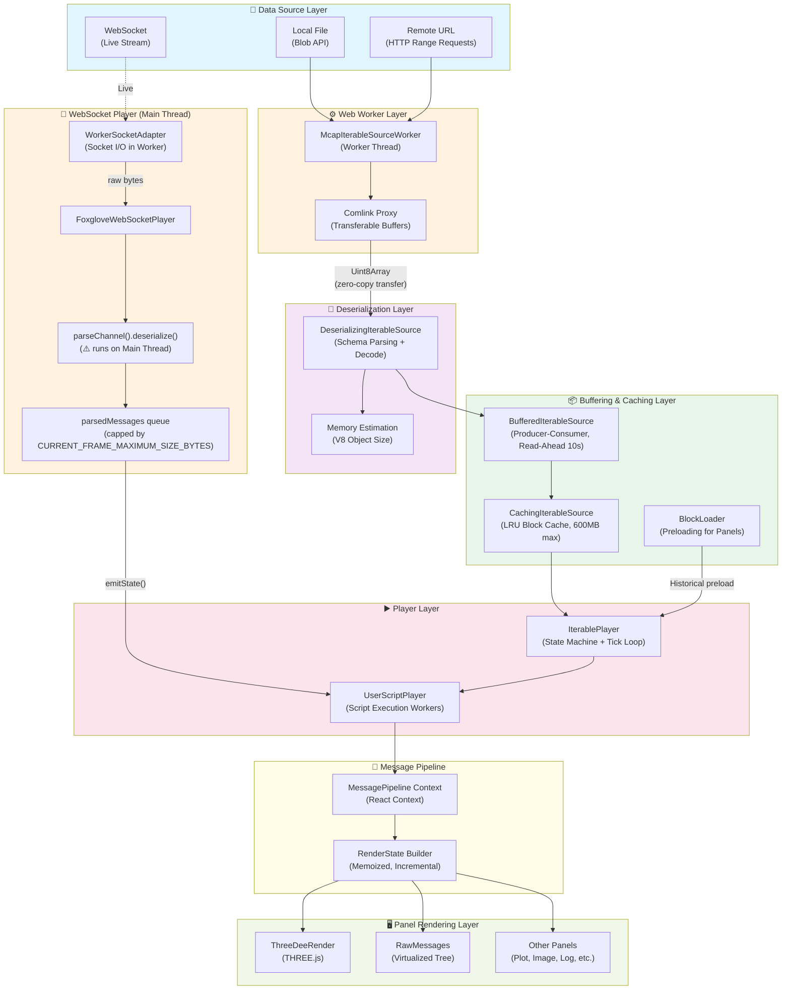
```mermaid
flowchart TB
    subgraph DataSource["📁 Data Source Layer"]
        LocalFile["Local File<br/>(Blob API)"]
        RemoteURL["Remote URL<br/>(HTTP Range Requests)"]
        WebSocket["WebSocket<br/>(Live Stream)"]
    end

    subgraph WorkerLayer["⚙️ Web Worker Layer"]
        McapWorker["McapIterableSourceWorker<br/>(Worker Thread)"]
        Comlink["Comlink Proxy<br/>(Transferable Buffers)"]
    end

    subgraph DeserLayer["🔄 Deserialization Layer"]
        DeserSource["DeserializingIterableSource<br/>(Schema Parsing + Decode)"]
        MemEstimation["Memory Estimation<br/>(V8 Object Size)"]
    end

    subgraph BufferLayer["📦 Buffering & Caching Layer"]
        BufferedSource["BufferedIterableSource<br/>(Producer-Consumer, Read-Ahead 10s)"]
        CachingSource["CachingIterableSource<br/>(LRU Block Cache, 600MB max)"]
        BlockLoader["BlockLoader<br/>(Preloading for Panels)"]
    end

    subgraph WSPlayerLayer["📡 WebSocket Player (Main Thread)"]
        WSWorker["WorkerSocketAdapter<br/>(Socket I/O in Worker)"]
        WSPlayer["FoxgloveWebSocketPlayer"]
        WSDeser["parseChannel().deserialize()<br/>(⚠️ runs on Main Thread)"]
        WSBuffer["parsedMessages queue<br/>(capped by CURRENT_FRAME_MAXIMUM_SIZE_BYTES)"]
    end

    subgraph PlayerLayer["▶️ Player Layer"]
        IterablePlayer["IterablePlayer<br/>(State Machine + Tick Loop)"]
        UserScriptPlayer["UserScriptPlayer<br/>(Script Execution Workers)"]
    end

    subgraph PipelineLayer["🔗 Message Pipeline"]
        MsgPipeline["MessagePipeline Context<br/>(React Context)"]
        RenderState["RenderState Builder<br/>(Memoized, Incremental)"]
    end

    subgraph PanelLayer["🖥️ Panel Rendering Layer"]
        ThreeDee["ThreeDeeRender<br/>(THREE.js)"]
        RawMsg["RawMessages<br/>(Virtualized Tree)"]
        OtherPanels["Other Panels<br/>(Plot, Image, Log, etc.)"]
    end

    LocalFile --> McapWorker
    RemoteURL --> McapWorker
    WebSocket -.->|"Live"| WSWorker

    WSWorker -->|"raw bytes"| WSPlayer
    WSPlayer --> WSDeser
    WSDeser --> WSBuffer
    WSBuffer -->|"emitState()"| UserScriptPlayer

    McapWorker --> Comlink
    Comlink -->|"Uint8Array<br/>(zero-copy transfer)"| DeserSource
    DeserSource --> MemEstimation
    DeserSource --> BufferedSource
    BufferedSource --> CachingSource
    CachingSource --> IterablePlayer
    BlockLoader -->|"Historical preload"| IterablePlayer

    IterablePlayer --> UserScriptPlayer
    UserScriptPlayer --> MsgPipeline
    MsgPipeline --> RenderState

    RenderState --> ThreeDee
    RenderState --> RawMsg
    RenderState --> OtherPanels

    style DataSource fill:#e1f5fe
    style WorkerLayer fill:#fff3e0
    style DeserLayer fill:#f3e5f5
    style BufferLayer fill:#e8f5e9
    style WSPlayerLayer fill:#fff3e0
    style PlayerLayer fill:#fce4ec
    style PipelineLayer fill:#fffde7
    style PanelLayer fill:#f1f8e9
```

### Critical Performance Points (per layer)

| Layer           | Main Problem                        | Impact                |
| --------------- | ----------------------------------- | --------------------- |
| Data Source     | Disk / network I/O                  | Open and read latency |
| Worker          | Cross-thread communication overhead | Transfer latency      |
| Deserialization | CPU-bound (schema parsing)          | Playback jank         |
| Buffering/Cache | Memory pressure                     | OOM, tab crash        |
| Player          | Tick overflow (too many msgs/tick)  | Choppy playback       |
| Rendering       | GPU/CPU bound (point clouds, 3D)    | Low FPS               |
| Panels (React)  | Unnecessary re-renders              | UI lag                |
| User Scripts    | Per-message execution               | Cumulative delay      |

---

## 2. Connection Types (Data Sources)

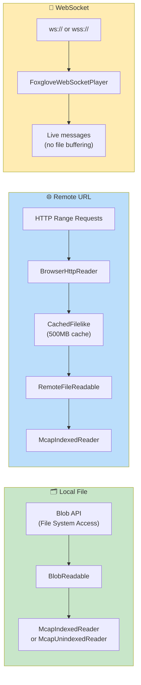
```mermaid
flowchart LR
    subgraph LocalFile["🗂️ Local File"]
        direction TB
        LF1["Blob API<br/>(File System Access)"]
        LF2["BlobReadable"]
        LF3["McapIndexedReader<br/>or McapUnindexedReader"]
        LF1 --> LF2 --> LF3
    end

    subgraph RemoteURL["🌐 Remote URL"]
        direction TB
        RF1["HTTP Range Requests"]
        RF2["BrowserHttpReader"]
        RF3["CachedFilelike<br/>(500MB cache)"]
        RF4["RemoteFileReadable"]
        RF5["McapIndexedReader"]
        RF1 --> RF2 --> RF3 --> RF4 --> RF5
    end

    subgraph WSConnection["📡 WebSocket"]
        direction TB
        WS1["ws:// or wss://"]
        WS2["FoxgloveWebSocketPlayer"]
        WS3["Live messages<br/>(no file buffering)"]
        WS1 --> WS2 --> WS3
    end

    style LocalFile fill:#c8e6c9
    style RemoteURL fill:#bbdefb
    style WSConnection fill:#ffecb3
```

### Performance Comparison by Connection Type

| Aspect              | Local File            | Remote URL                       | WebSocket                      |
| ------------------- | --------------------- | -------------------------------- | ------------------------------ |
| **Initial latency** | Low (local I/O)       | Medium-High (index download)     | Low (handshake)                |
| **Throughput**      | High (SSD/NVMe)       | Limited by network               | Limited by network + publisher |
| **Seek**            | Fast (indexed)        | Medium (range requests + cache)  | N/A (live only)                |
| **Memory**          | Worker buffer + cache | HTTP cache 500MB + Worker buffer | Live message buffer            |
| **40GB scenario**   | ✅ Viable (indexed)   | ⚠️ High seek latency             | ❌ N/A                         |
| **Back-pressure**   | Controlled by player  | Controlled by player             | ⚠️ Can accumulate              |

### Data Source Factories

```
McapLocalDataSourceFactory      → IterablePlayer (readAhead: 120s)
RemoteDataSourceFactory         → IterablePlayer (readAhead: default)
Ros1LocalBagDataSourceFactory   → IterablePlayer
Ros2LocalBagDataSourceFactory   → IterablePlayer
FoxgloveWebSocketDataSourceFactory → FoxgloveWebSocketPlayer (live)
RosbridgeDataSourceFactory      → FoxgloveWebSocketPlayer (live)
```

---

## 3. MCAP — Structure and Reading

### 3.1 MCAP File Format Structure

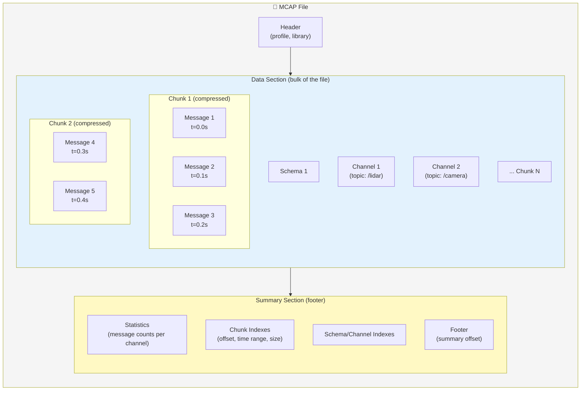
```mermaid
flowchart TB
    subgraph MCAPFile["📄 MCAP File"]
        direction TB
        Header["Header<br/>(profile, library)"]

        subgraph DataSection["Data Section (bulk of the file)"]
            direction TB
            Schema1["Schema 1"]
            Channel1["Channel 1<br/>(topic: /lidar)"]
            Channel2["Channel 2<br/>(topic: /camera)"]

            subgraph Chunk1["Chunk 1 (compressed)"]
                M1["Message 1<br/>t=0.0s"]
                M2["Message 2<br/>t=0.1s"]
                M3["Message 3<br/>t=0.2s"]
            end

            subgraph Chunk2["Chunk 2 (compressed)"]
                M4["Message 4<br/>t=0.3s"]
                M5["Message 5<br/>t=0.4s"]
            end

            ChunkN["... Chunk N"]
        end

        subgraph Summary["Summary Section (footer)"]
            direction TB
            Stats["Statistics<br/>(message counts per channel)"]
            ChunkIndex["Chunk Indexes<br/>(offset, time range, size)"]
            SchemaIdx["Schema/Channel Indexes"]
            Footer["Footer<br/>(summary offset)"]
        end

        Header --> DataSection
        DataSection --> Summary
    end

    style MCAPFile fill:#f5f5f5
    style DataSection fill:#e3f2fd
    style Summary fill:#fff9c4
```

### 3.2 Indexed vs Unindexed

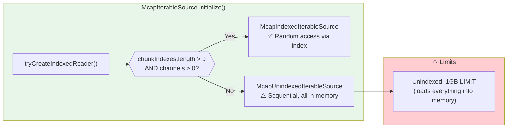
```mermaid
flowchart LR
    subgraph Decision["McapIterableSource.initialize()"]
        direction TB
        TryIndexed["tryCreateIndexedReader()"]
        HasIndex{{"chunkIndexes.length > 0<br/>AND channels > 0?"}}
        Indexed["McapIndexedIterableSource<br/>✅ Random access via index"]
        Unindexed["McapUnindexedIterableSource<br/>⚠️ Sequential, all in memory"]

        TryIndexed --> HasIndex
        HasIndex -->|"Yes"| Indexed
        HasIndex -->|"No"| Unindexed
    end

    subgraph Limits["⚠️ Limits"]
        UnindexedLimit["Unindexed: 1GB LIMIT<br/>(loads everything into memory)"]
    end

    Unindexed --> UnindexedLimit

    style Decision fill:#e8f5e9
    style Limits fill:#ffcdd2
```

### 3.3 Performance Impact — Massive MCAP Data

#### Scenario: 40GB MCAP

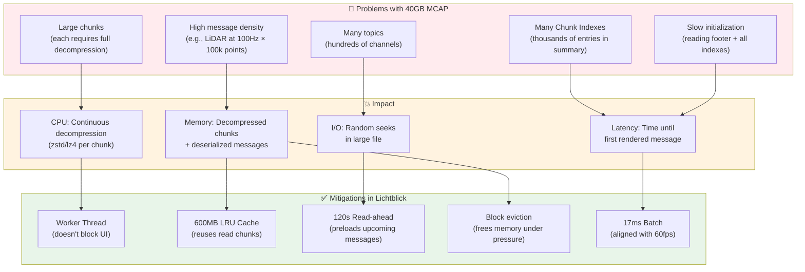
```mermaid
flowchart TB
    subgraph Problem["🔴 Problems with 40GB MCAP"]
        direction TB
        P1["Many Chunk Indexes<br/>(thousands of entries in summary)"]
        P2["Large chunks<br/>(each requires full decompression)"]
        P3["High message density<br/>(e.g., LiDAR at 100Hz × 100k points)"]
        P4["Many topics<br/>(hundreds of channels)"]
        P5["Slow initialization<br/>(reading footer + all indexes)"]
    end

    subgraph Impact["💥 Impact"]
        I1["CPU: Continuous decompression<br/>(zstd/lz4 per chunk)"]
        I2["Memory: Decompressed chunks<br/>+ deserialized messages"]
        I3["I/O: Random seeks<br/>in large file"]
        I4["Latency: Time until<br/>first rendered message"]
    end

    subgraph Solutions["✅ Mitigations in Lichtblick"]
        S1["Worker Thread<br/>(doesn't block UI)"]
        S2["600MB LRU Cache<br/>(reuses read chunks)"]
        S3["120s Read-ahead<br/>(preloads upcoming messages)"]
        S4["Block eviction<br/>(frees memory under pressure)"]
        S5["17ms Batch<br/>(aligned with 60fps)"]
    end

    P1 --> I4
    P2 --> I1
    P3 --> I2
    P4 --> I3
    P5 --> I4

    I1 --> S1
    I2 --> S2
    I3 --> S3
    I4 --> S5
    I2 --> S4

    style Problem fill:#ffebee
    style Impact fill:#fff3e0
    style Solutions fill:#e8f5e9
```

#### Factors That Scale the Problem

| Factor              | Typical Value | Problematic Value   | Why it's a problem                |
| ------------------- | ------------- | ------------------- | --------------------------------- |
| File size           | 1-5 GB        | 40+ GB              | More chunks to index, more I/O    |
| Number of topics    | 10-30         | 200+                | More channels to filter per chunk |
| Msgs/second (total) | 1000          | 50,000+             | More messages per tick window     |
| Average msg size    | 1 KB          | 1 MB (point clouds) | Memory pressure in buffer         |
| Recording duration  | 5 min         | 2+ hours            | More preload blocks               |
| Chunk size          | 4 MB          | 64 MB               | Heavier decompression             |

---

## 4. Worker and Deserialization

### 4.1 Worker Architecture (Comlink)

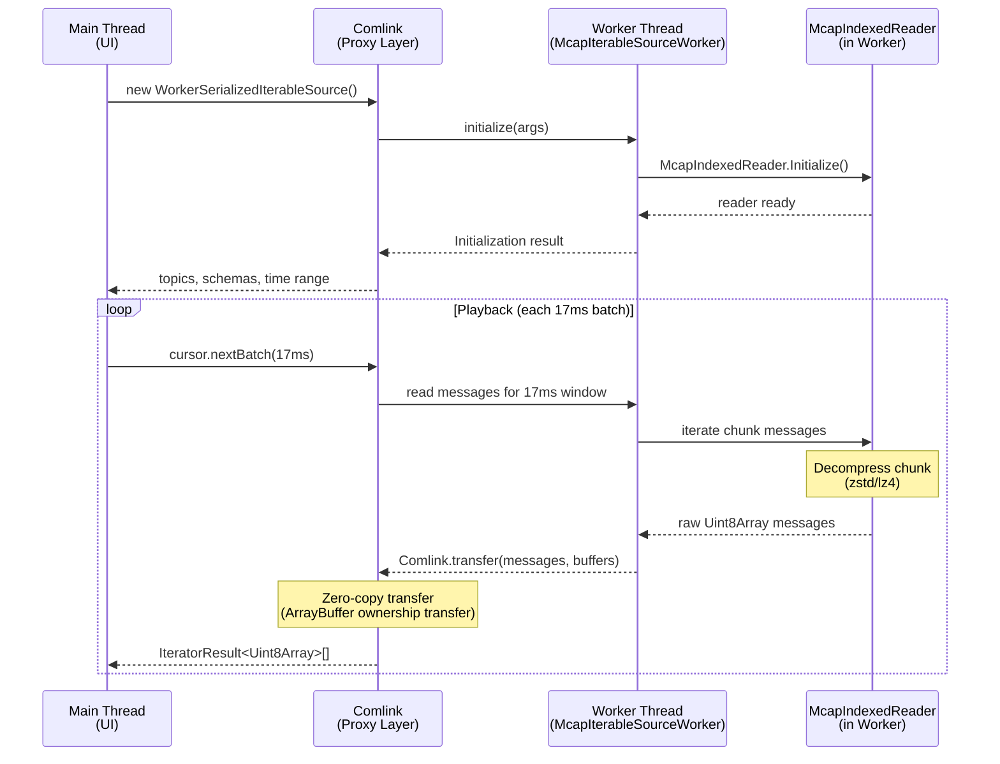
```mermaid
sequenceDiagram
    participant MainThread as Main Thread<br/>(UI)
    participant Comlink as Comlink<br/>(Proxy Layer)
    participant Worker as Worker Thread<br/>(McapIterableSourceWorker)
    participant McapReader as McapIndexedReader<br/>(in Worker)

    MainThread->>Comlink: new WorkerSerializedIterableSource()
    Comlink->>Worker: initialize(args)
    Worker->>McapReader: McapIndexedReader.Initialize()
    McapReader-->>Worker: reader ready
    Worker-->>Comlink: Initialization result
    Comlink-->>MainThread: topics, schemas, time range

    loop Playback (each 17ms batch)
        MainThread->>Comlink: cursor.nextBatch(17ms)
        Comlink->>Worker: read messages for 17ms window
        Worker->>McapReader: iterate chunk messages
        Note over McapReader: Decompress chunk<br/>(zstd/lz4)
        McapReader-->>Worker: raw Uint8Array messages
        Worker-->>Comlink: Comlink.transfer(messages, buffers)
        Note over Comlink: Zero-copy transfer<br/>(ArrayBuffer ownership transfer)
        Comlink-->>MainThread: IteratorResult<Uint8Array>[]
    end
```

### 4.2 Deserialization Pipeline

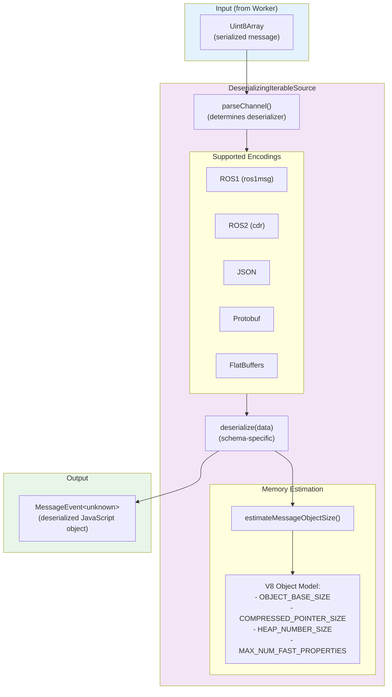
```mermaid
flowchart TB
    subgraph Input["Input (from Worker)"]
        RawBytes["Uint8Array<br/>(serialized message)"]
    end

    subgraph DeserProcess["DeserializingIterableSource"]
        ParseChannel["parseChannel()<br/>(determines deserializer)"]

        subgraph Encodings["Supported Encodings"]
            ROS1["ROS1 (ros1msg)"]
            ROS2["ROS2 (cdr)"]
            JSON["JSON"]
            Protobuf["Protobuf"]
            Flatbuffers["FlatBuffers"]
        end

        Deserialize["deserialize(data)<br/>(schema-specific)"]

        subgraph MemEst["Memory Estimation"]
            ObjSize["estimateMessageObjectSize()"]
            V8Model["V8 Object Model:<br/>- OBJECT_BASE_SIZE<br/>- COMPRESSED_POINTER_SIZE<br/>- HEAP_NUMBER_SIZE<br/>- MAX_NUM_FAST_PROPERTIES"]
        end
    end

    subgraph Output["Output"]
        DeserMsg["MessageEvent&lt;unknown&gt;<br/>(deserialized JavaScript object)"]
    end

    RawBytes --> ParseChannel
    ParseChannel --> Encodings
    Encodings --> Deserialize
    Deserialize --> ObjSize
    ObjSize --> V8Model
    Deserialize --> DeserMsg

    style Input fill:#e3f2fd
    style DeserProcess fill:#f3e5f5
    style Output fill:#e8f5e9
```

### 4.3 Deserialization Performance

**Problem:** With 50,000 messages/second, deserialization is CPU-bound.

**Specific bottlenecks:**

- **Protobuf/CDR with complex schemas:** Deep nested objects require many allocations
- **Point Clouds (ROS):** `sensor_msgs/PointCloud2` has binary data that needs field-by-field interpretation
- **Large strings:** JSON serialization/deserialization with large payloads

**Implemented optimizations:**

1. Worker thread separates deserialization from UI
2. Transferable buffers avoid binary data copying
3. 17ms batching limits volume per frame
4. Memory estimation enables monitoring memory pressure

---

## 5. Caching and Buffering

### 5.1 Layered Cache Architecture

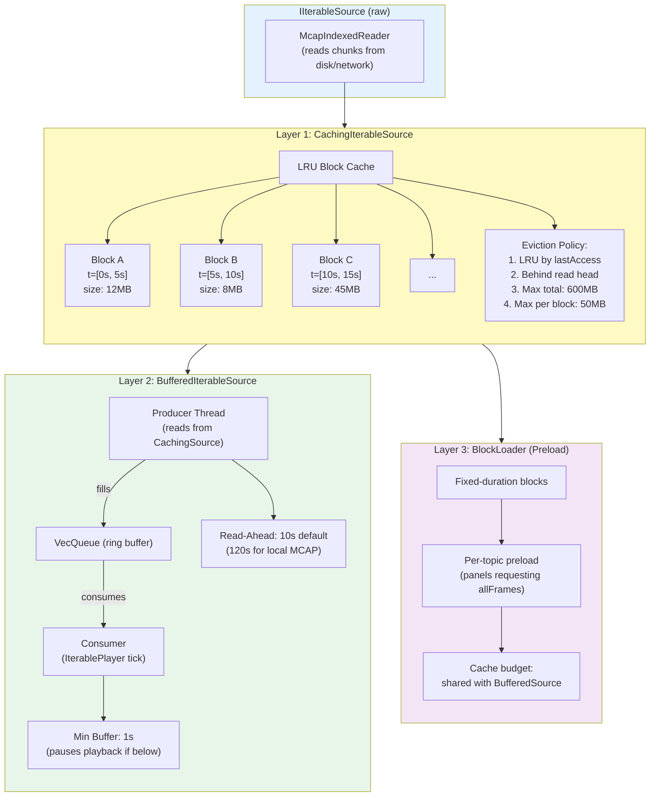
```mermaid
flowchart TB
    subgraph Source["IIterableSource (raw)"]
        McapReader["McapIndexedReader<br/>(reads chunks from disk/network)"]
    end

    subgraph Layer1["Layer 1: CachingIterableSource"]
        direction TB
        Cache["LRU Block Cache"]
        Block1["Block A<br/>t=[0s, 5s]<br/>size: 12MB"]
        Block2["Block B<br/>t=[5s, 10s]<br/>size: 8MB"]
        Block3["Block C<br/>t=[10s, 15s]<br/>size: 45MB"]
        BlockN["..."]

        Eviction["Eviction Policy:<br/>1. LRU by lastAccess<br/>2. Behind read head<br/>3. Max total: 600MB<br/>4. Max per block: 50MB"]

        Cache --> Block1
        Cache --> Block2
        Cache --> Block3
        Cache --> BlockN
        Cache --> Eviction
    end

    subgraph Layer2["Layer 2: BufferedIterableSource"]
        direction TB
        Producer["Producer Thread<br/>(reads from CachingSource)"]
        Buffer["VecQueue (ring buffer)"]
        Consumer["Consumer<br/>(IterablePlayer tick)"]

        ReadAhead["Read-Ahead: 10s default<br/>(120s for local MCAP)"]
        MinBuffer["Min Buffer: 1s<br/>(pauses playback if below)"]

        Producer -->|"fills"| Buffer
        Buffer -->|"consumes"| Consumer
        Producer --> ReadAhead
        Consumer --> MinBuffer
    end

    subgraph Layer3["Layer 3: BlockLoader (Preload)"]
        direction TB
        Blocks["Fixed-duration blocks"]
        Preload["Per-topic preload<br/>(panels requesting allFrames)"]
        MaxCache["Cache budget:<br/>shared with BufferedSource"]

        Blocks --> Preload
        Preload --> MaxCache
    end

    McapReader --> Layer1
    Layer1 --> Layer2
    Layer1 --> Layer3

    style Source fill:#e3f2fd
    style Layer1 fill:#fff9c4
    style Layer2 fill:#e8f5e9
    style Layer3 fill:#f3e5f5
```

### 5.2 Cache Decision Flow

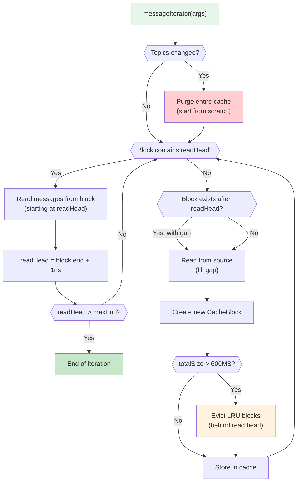
```mermaid
flowchart TD
    Start["messageIterator(args)"] --> TopicChange{{"Topics changed?"}}
    TopicChange -->|"Yes"| PurgeCache["Purge entire cache<br/>(start from scratch)"]
    TopicChange -->|"No"| FindBlock{{"Block contains readHead?"}}

    PurgeCache --> FindBlock

    FindBlock -->|"Yes"| ReadFromCache["Read messages from block<br/>(starting at readHead)"]
    FindBlock -->|"No"| CheckAfter{{"Block exists after readHead?"}}

    ReadFromCache --> UpdateReadHead["readHead = block.end + 1ns"]
    UpdateReadHead --> CheckDone{{"readHead > maxEnd?"}}
    CheckDone -->|"Yes"| Done["End of iteration"]
    CheckDone -->|"No"| FindBlock

    CheckAfter -->|"Yes, with gap"| ReadSource["Read from source<br/>(fill gap)"]
    CheckAfter -->|"No"| ReadSource

    ReadSource --> NewBlock["Create new CacheBlock"]
    NewBlock --> CheckSize{{"totalSize > 600MB?"}}
    CheckSize -->|"Yes"| Evict["Evict LRU blocks<br/>(behind read head)"]
    CheckSize -->|"No"| StoreBlock["Store in cache"]
    Evict --> StoreBlock
    StoreBlock --> FindBlock

    style Start fill:#e8f5e9
    style Done fill:#c8e6c9
    style PurgeCache fill:#ffcdd2
    style Evict fill:#fff3e0
```

### 5.3 Critical Numbers (from code)

| Constant                            | Value               | File                                |
| ----------------------------------- | ------------------- | ----------------------------------- |
| `maxTotalSizeBytes`                 | 629,145,600 (600MB) | `CachingIterableSource.ts`          |
| `maxBlockSizeBytes`                 | 52,428,800 (50MB)   | `CachingIterableSource.ts`          |
| `DEFAULT_READ_AHEAD_DURATION`       | 10 seconds          | `BufferedIterableSource.ts`         |
| `MIN_READ_AHEAD_DURATION`           | 1 second            | `BufferedIterableSource.ts`         |
| `readAheadDuration` (local MCAP)    | 120 seconds         | `McapLocalDataSourceFactory.ts`     |
| `DEFAULT_CACHE_SIZE_BYTES` (remote) | 524,288,000 (500MB) | `RemoteFileReadable.ts`             |
| Batch size (worker)                 | 17ms                | `WorkerSerializedIterableSource.ts` |

### 5.4 Browser Memory Limit — The 4GB Ceiling (OOM)

Chromium-based browsers impose a hard limit of ~4GB for the V8 heap per renderer process. Lichtblick web operates within this constraint, and with massive MCAPs the sum of all memory layers can easily reach this ceiling, causing **tab crash (OOM)**.

#### Memory Consumers in the Browser

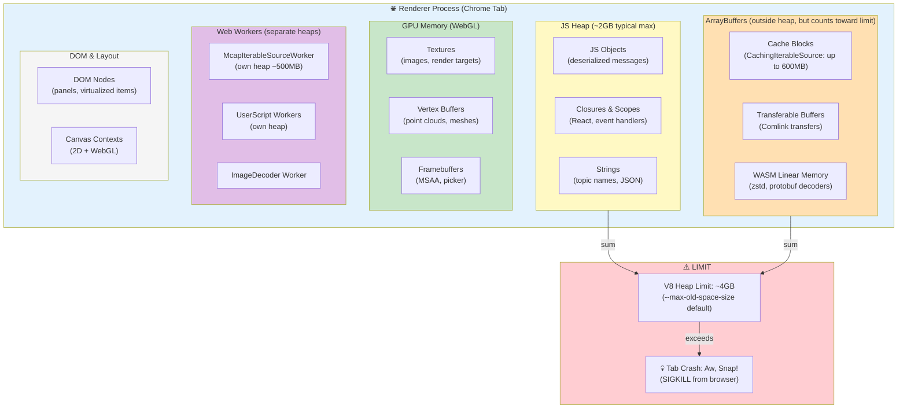
```mermaid
flowchart TB
    subgraph BrowserProcess["🌐 Renderer Process (Chrome Tab)"]
        direction TB

        subgraph JSHeap["JS Heap (~2GB typical max)"]
            Objects["JS Objects<br/>(deserialized messages)"]
            Closures["Closures & Scopes<br/>(React, event handlers)"]
            Strings["Strings<br/>(topic names, JSON)"]
        end

        subgraph ArrayBuffers["ArrayBuffers (outside heap, but counts toward limit)"]
            CacheBlocks["Cache Blocks<br/>(CachingIterableSource: up to 600MB)"]
            WorkerTransfers["Transferable Buffers<br/>(Comlink transfers)"]
            WasmMemory["WASM Linear Memory<br/>(zstd, protobuf decoders)"]
        end

        subgraph GPU["GPU Memory (WebGL)"]
            Textures["Textures<br/>(images, render targets)"]
            VBOs["Vertex Buffers<br/>(point clouds, meshes)"]
            FBOs["Framebuffers<br/>(MSAA, picker)"]
        end

        subgraph Workers["Web Workers (separate heaps)"]
            McapWorker["McapIterableSourceWorker<br/>(own heap ~500MB)"]
            UserScriptWorker["UserScript Workers<br/>(own heap)"]
            ImageWorker["ImageDecoder Worker"]
        end

        subgraph DOM["DOM & Layout"]
            DOMNodes["DOM Nodes<br/>(panels, virtualized items)"]
            CanvasCtx["Canvas Contexts<br/>(2D + WebGL)"]
        end
    end

    subgraph Limit["⚠️ LIMIT"]
        V8Limit["V8 Heap Limit: ~4GB<br/>(--max-old-space-size default)"]
        TabCrash["💀 Tab Crash: Aw, Snap!<br/>(SIGKILL from browser)"]
    end

    JSHeap -->|"sum"| V8Limit
    ArrayBuffers -->|"sum"| V8Limit
    V8Limit -->|"exceeds"| TabCrash

    style BrowserProcess fill:#e3f2fd
    style JSHeap fill:#fff9c4
    style ArrayBuffers fill:#ffe0b2
    style GPU fill:#c8e6c9
    style Workers fill:#e1bee7
    style DOM fill:#f5f5f5
    style Limit fill:#ffcdd2
```

> **Note:** Workers have separate V8 heaps (~4GB each), but when buffers are **transferred** (Comlink.transfer) ownership passes to the receiver — and counts toward the receiver's heap.

#### Memory Consumption — Normal vs Problematic Scenario

| Component                                 | Normal Scenario (5GB MCAP, 30 topics) | Problematic Scenario (40GB MCAP, 200+ topics, point clouds) |
| ----------------------------------------- | ------------------------------------- | ----------------------------------------------------------- |
| Cache blocks (CachingIterableSource)      | ~200MB                                | ~600MB (cap reached)                                        |
| Deserialized messages in memory           | ~100MB                                | ~400MB+                                                     |
| BlockLoader (preload allFrames)           | ~50MB                                 | ~300MB+                                                     |
| WebGL buffers (3D panel)                  | ~50MB                                 | ~500MB+ (multiple point clouds with decay)                  |
| React component tree + DOM                | ~30MB                                 | ~80MB                                                       |
| WASM heaps (decoders)                     | ~20MB                                 | ~50MB                                                       |
| V8 overhead (GC metadata, hidden classes) | ~50MB                                 | ~150MB                                                      |
| **TOTAL**                                 | **~500MB**                            | **~2.1GB+**                                                 |

#### Multiplier Effect — How It Reaches Crash

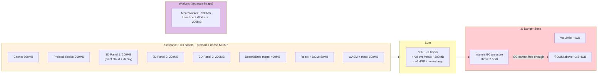
```mermaid
flowchart LR
    subgraph Scenario["Scenario: 3 3D panels + preload + dense MCAP"]
        direction TB
        Cache["Cache: 600MB"]
        Preload["Preload blocks: 300MB"]
        Panel1["3D Panel 1: 200MB<br/>(point cloud + decay)"]
        Panel2["3D Panel 2: 200MB"]
        Panel3["3D Panel 3: 200MB"]
        Deser["Deserialized msgs: 400MB"]
        React["React + DOM: 80MB"]
        WASM["WASM + misc: 100MB"]
    end

    subgraph Sum["Sum"]
        Total["Total: ~2.08GB<br/>+ V8 overhead: ~300MB<br/>= ~2.4GB in main heap"]
    end

    subgraph WorkerSide["Workers (separate heaps)"]
        WHeap["McapWorker: ~500MB<br/>UserScript Workers: ~200MB"]
    end

    subgraph Danger["⚠️ Danger Zone"]
        Threshold["V8 Limit: ~4GB"]
        GC["Intense GC pressure<br/>above 2.5GB"]
        Crash["💀 OOM above ~3.5-4GB"]
    end

    Scenario --> Sum
    Sum --> GC
    GC -->|"GC cannot free enough"| Crash

    style Scenario fill:#fff3e0
    style Sum fill:#fff9c4
    style WorkerSide fill:#e1bee7
    style Danger fill:#ffcdd2
```

#### Desktop (Electron) vs Web — Memory Limits

| Aspect                     | Desktop (Electron)                                           | Web (Chrome/Firefox)             |
| -------------------------- | ------------------------------------------------------------ | -------------------------------- |
| **V8 Limit**               | Configurable via `--max-old-space-size`                      | ~4GB (browser hard limit)        |
| **Total available memory** | System memory (8-64GB+)                                      | Shared across all tabs           |
| **Renderer process**       | Dedicated process                                            | Shared with extensions, DevTools |
| **ArrayBuffers**           | Can exceed heap (mmap)                                       | Count toward process limit       |
| **Crash behavior**         | Can use swap, degrades gracefully                            | Immediate tab kill (OOM killer)  |
| **Possible mitigation**    | `app.commandLine.appendSwitch('max-old-space-size', '8192')` | None (browser limit)             |
| **40GB MCAP scenario**     | ✅ Works with proper configuration                           | ⚠️ High OOM risk                 |

#### Mitigation Strategies

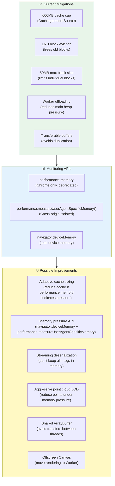
```mermaid
flowchart TB
    subgraph Current["✅ Current Mitigations"]
        M1["600MB cache cap<br/>(CachingIterableSource)"]
        M2["LRU block eviction<br/>(frees old blocks)"]
        M3["50MB max block size<br/>(limits individual blocks)"]
        M4["Worker offloading<br/>(reduces main heap pressure)"]
        M5["Transferable buffers<br/>(avoids duplication)"]
    end

    subgraph Possible["💡 Possible Improvements"]
        P1["Adaptive cache sizing<br/>(reduce cache if performance.memory<br/>indicates pressure)"]
        P2["Memory pressure API<br/>(navigator.deviceMemory +<br/>performance.measureUserAgentSpecificMemory)"]
        P3["Streaming deserialization<br/>(don't keep all msgs in memory)"]
        P4["Aggressive point cloud LOD<br/>(reduce points under memory pressure)"]
        P5["Shared ArrayBuffer<br/>(avoid transfers between threads)"]
        P6["Offscreen Canvas<br/>(move rendering to Worker)"]
    end

    subgraph Monitor["📊 Monitoring APIs"]
        API1["performance.memory<br/>(Chrome only, deprecated)"]
        API2["performance.measureUserAgentSpecificMemory()<br/>(Cross-origin isolated)"]
        API3["navigator.deviceMemory<br/>(total device memory)"]
    end

    Current --> Monitor
    Monitor --> Possible

    style Current fill:#e8f5e9
    style Possible fill:#fff9c4
    style Monitor fill:#e3f2fd
```

#### Typical Memory Distribution in Problematic Scenario

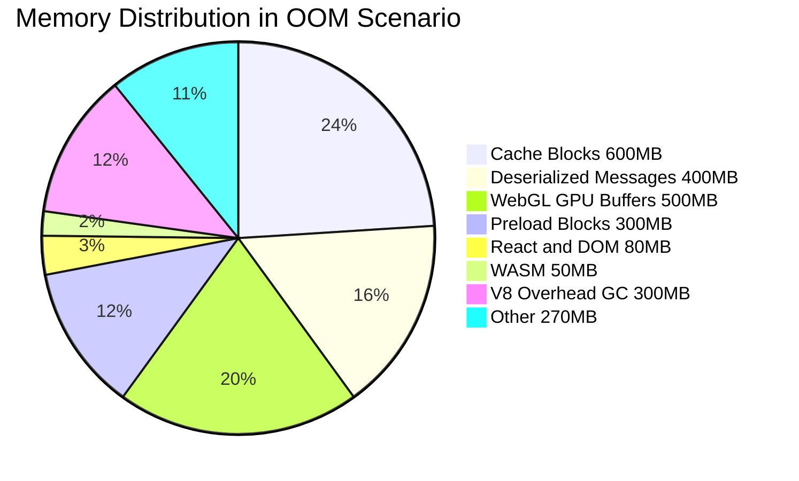
```mermaid
pie title Memory Distribution in OOM Scenario
    "Cache Blocks 600MB" : 600
    "Deserialized Messages 400MB" : 400
    "WebGL GPU Buffers 500MB" : 500
    "Preload Blocks 300MB" : 300
    "React and DOM 80MB" : 80
    "WASM 50MB" : 50
    "V8 Overhead GC 300MB" : 300
    "Other 270MB" : 270
```

#### Key Points About the 4GB Limit

1. **The limit is per renderer process**, not per tab (although generally 1 tab = 1 process)
2. **Transferred ArrayBuffers** count toward the receiver's heap — Comlink's zero-copy transfers ownership, it doesn't eliminate consumption
3. **GC becomes inefficient** above ~2.5GB — longer GC pauses cause jank even before OOM
4. **The browser kills the tab without warning** — there's no possible `try/catch` for OOM
5. **Multiple 3D panels** multiply GPU memory consumption which also pressures the process
6. **Electron (desktop)** doesn't suffer from this limit because it can be configured with a larger `--max-old-space-size`

---

## 6. Player — Tick Loop and State

### 6.1 State Machine

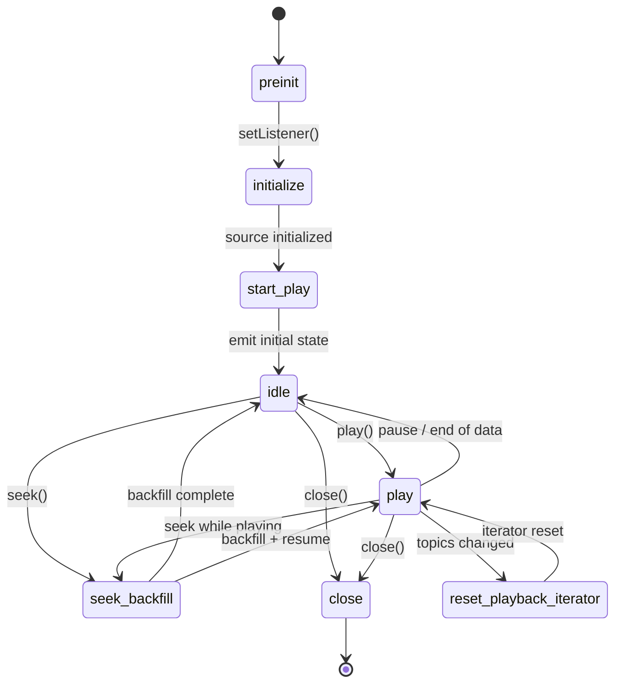
```mermaid
stateDiagram-v2
    [*] --> preinit
    preinit --> initialize: setListener()
    initialize --> start_play: source initialized
    start_play --> idle: emit initial state

    idle --> play: play()
    idle --> seek_backfill: seek()
    idle --> close: close()

    play --> idle: pause / end of data
    play --> seek_backfill: seek while playing
    play --> reset_playback_iterator: topics changed
    play --> close: close()

    seek_backfill --> idle: backfill complete
    seek_backfill --> play: backfill + resume

    reset_playback_iterator --> play: iterator reset

    close --> [*]
```

### 6.2 Tick Loop — Read Algorithm

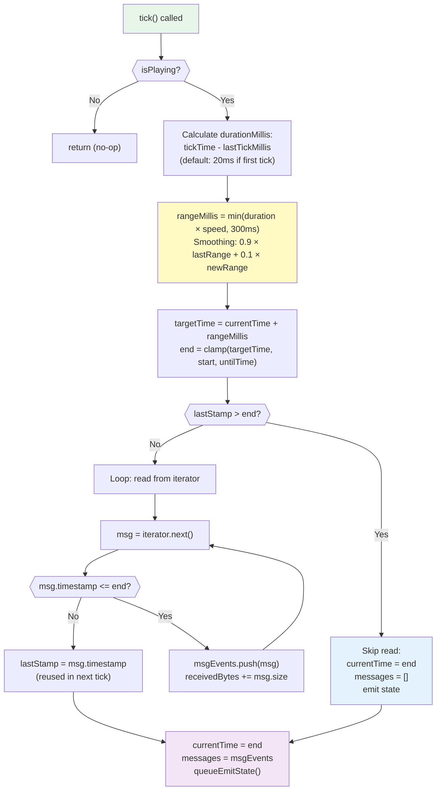
```mermaid
flowchart TB
    TickStart["tick() called"] --> IsPlaying{{"isPlaying?"}}
    IsPlaying -->|"No"| Return["return (no-op)"]
    IsPlaying -->|"Yes"| CalcDuration["Calculate durationMillis:<br/>tickTime - lastTickMillis<br/>(default: 20ms if first tick)"]

    CalcDuration --> CalcRange["rangeMillis = min(duration × speed, 300ms)<br/>Smoothing: 0.9 × lastRange + 0.1 × newRange"]

    CalcRange --> CalcEnd["targetTime = currentTime + rangeMillis<br/>end = clamp(targetTime, start, untilTime)"]

    CalcEnd --> CheckLastStamp{{"lastStamp > end?"}}
    CheckLastStamp -->|"Yes"| ShortCircuit["Skip read:<br/>currentTime = end<br/>messages = []<br/>emit state"]
    CheckLastStamp -->|"No"| ReadLoop["Loop: read from iterator"]

    ReadLoop --> ReadMsg["msg = iterator.next()"]
    ReadMsg --> CheckMsg{{"msg.timestamp <= end?"}}
    CheckMsg -->|"Yes"| AddMsg["msgEvents.push(msg)<br/>receivedBytes += msg.size"]
    AddMsg --> ReadMsg
    CheckMsg -->|"No"| SaveStamp["lastStamp = msg.timestamp<br/>(reused in next tick)"]

    SaveStamp --> Emit["currentTime = end<br/>messages = msgEvents<br/>queueEmitState()"]
    ShortCircuit --> Emit

    style TickStart fill:#e8f5e9
    style CalcRange fill:#fff9c4
    style ShortCircuit fill:#e3f2fd
    style Emit fill:#f3e5f5
```

### 6.3 Tick Loop Performance

**Key problem:** With many messages in a short period, a single tick can process thousands of messages.

**Protection mechanisms:**

1. **300ms cap:** Never reads more than 300ms of data per tick (even at high speed)
2. **EMA Smoothing:** Smooths variations between ticks (prevents oscillations)
3. **Short-circuit via lastStamp:** If the next message is after tick end, skips reading
4. **Sampling (DeserializingIterableSource):** `setSamplingWindowEnd()` allows limiting the window

**Problematic scenario:**

```
MCAP with LiDAR at 100Hz, each msg = 1MB
→ In 300ms tick: 30 messages × 1MB = 30MB of deserialized data per tick
→ At 60fps: 30MB × 60 = 1.8GB/s throughput required
```

---

## 7. 3D Rendering

### 7.1 ThreeDeeRender Pipeline

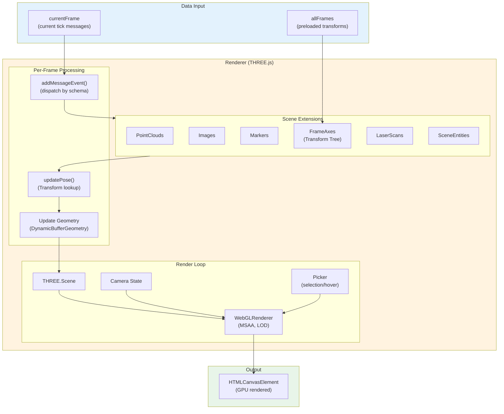
```mermaid
flowchart TB
    subgraph Input["Data Input"]
        CurrentFrame["currentFrame<br/>(current tick messages)"]
        AllFrames["allFrames<br/>(preloaded transforms)"]
    end

    subgraph Renderer["Renderer (THREE.js)"]
        direction TB

        subgraph Extensions["Scene Extensions"]
            PointClouds["PointClouds"]
            Images["Images"]
            Markers["Markers"]
            FrameAxes["FrameAxes<br/>(Transform Tree)"]
            LaserScans["LaserScans"]
            SceneEntities["SceneEntities"]
        end

        subgraph Processing["Per-Frame Processing"]
            AddMessage["addMessageEvent()<br/>(dispatch by schema)"]
            UpdatePose["updatePose()<br/>(Transform lookup)"]
            UpdateGeom["Update Geometry<br/>(DynamicBufferGeometry)"]
        end

        subgraph RenderLoop["Render Loop"]
            Scene["THREE.Scene"]
            Camera["Camera State"]
            WebGL["WebGLRenderer<br/>(MSAA, LOD)"]
            Picker["Picker<br/>(selection/hover)"]
        end
    end

    subgraph Output["Output"]
        Canvas["HTMLCanvasElement<br/>(GPU rendered)"]
    end

    CurrentFrame --> AddMessage
    AllFrames --> FrameAxes
    AddMessage --> Extensions
    Extensions --> UpdatePose
    UpdatePose --> UpdateGeom
    UpdateGeom --> Scene
    Scene --> WebGL
    Camera --> WebGL
    WebGL --> Canvas
    Picker --> WebGL

    style Input fill:#e3f2fd
    style Renderer fill:#fff3e0
    style Output fill:#e8f5e9
```

### 7.2 Point Clouds — The Heaviest Case

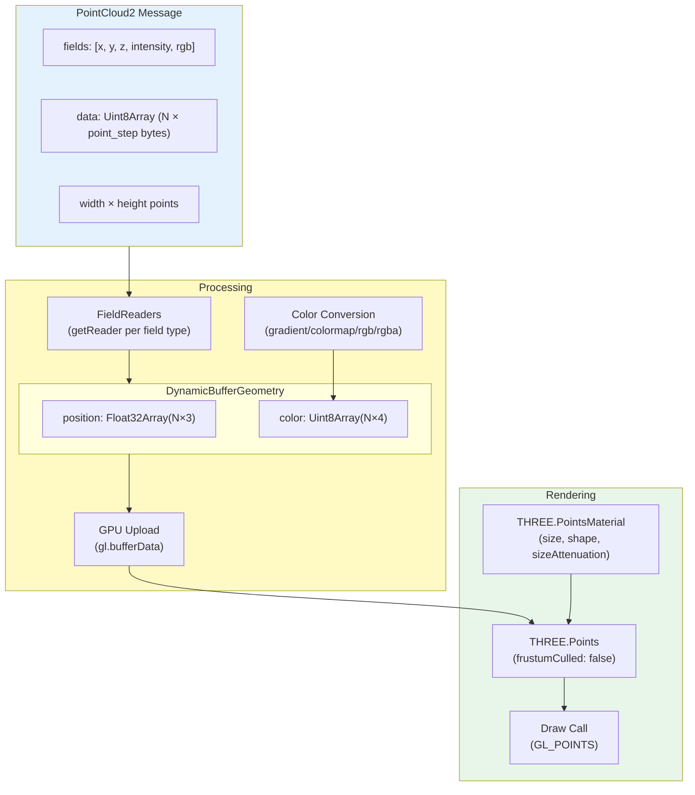
```mermaid
flowchart TB
    subgraph Message["PointCloud2 Message"]
        Fields["fields: [x, y, z, intensity, rgb]"]
        Data["data: Uint8Array (N × point_step bytes)"]
        Width["width × height points"]
    end

    subgraph Processing["Processing"]
        FieldReaders["FieldReaders<br/>(getReader per field type)"]
        ColorConvert["Color Conversion<br/>(gradient/colormap/rgb/rgba)"]

        subgraph Geometry["DynamicBufferGeometry"]
            PosAttr["position: Float32Array(N×3)"]
            ColAttr["color: Uint8Array(N×4)"]
        end

        Upload["GPU Upload<br/>(gl.bufferData)"]
    end

    subgraph Render["Rendering"]
        Material["THREE.PointsMaterial<br/>(size, shape, sizeAttenuation)"]
        Points["THREE.Points<br/>(frustumCulled: false)"]
        Draw["Draw Call<br/>(GL_POINTS)"]
    end

    Message --> FieldReaders
    FieldReaders --> Geometry
    ColorConvert --> ColAttr
    Geometry --> Upload
    Upload --> Points
    Material --> Points
    Points --> Draw

    style Message fill:#e3f2fd
    style Processing fill:#fff9c4
    style Render fill:#e8f5e9
```

### 7.3 3D Performance Problems

| Problem                 | Cause                                   | Impact                         | Mitigation                                    |
| ----------------------- | --------------------------------------- | ------------------------------ | --------------------------------------------- |
| **Giant point clouds**  | 100k+ points per frame, multiple clouds | GPU memory + draw calls        | `DynamicBufferGeometry` (reuses buffers), LOD |
| **Deep transform tree** | Hundreds of TF frames                   | CPU per message (lookup chain) | `MAX_TRANSFORM_MESSAGES` limit, preloading    |
| **Decay/History**       | `decayTime > 0` keeps history           | Memory accumulates geometries  | `RenderObjectHistory` with limit              |
| **Image decoding**      | Large images (1920×1080+)               | CPU on main thread             | `WorkerImageDecoder` (offload)                |
| **Shader compilation**  | Many different materials                | Stutter on first render        | Shader key caching (patched THREE.js)         |
| **Object picking**      | Raycasting on many objects              | CPU spike on hover/click       | `HOVER_PICK_THROTTLE_MS`, layer-based         |

### 7.4 Level of Detail (LOD)

```typescript
// packages/suite-base/src/panels/ThreeDeeRender/lod.ts
enum DetailLevel {
  Low,
  Medium,
  High,
}
// msaaSamples varies by level: Low=0, Medium=2, High=4
```

---

## 8. React Panels and Virtualization

### 8.1 PanelExtensionAdapter — Render State

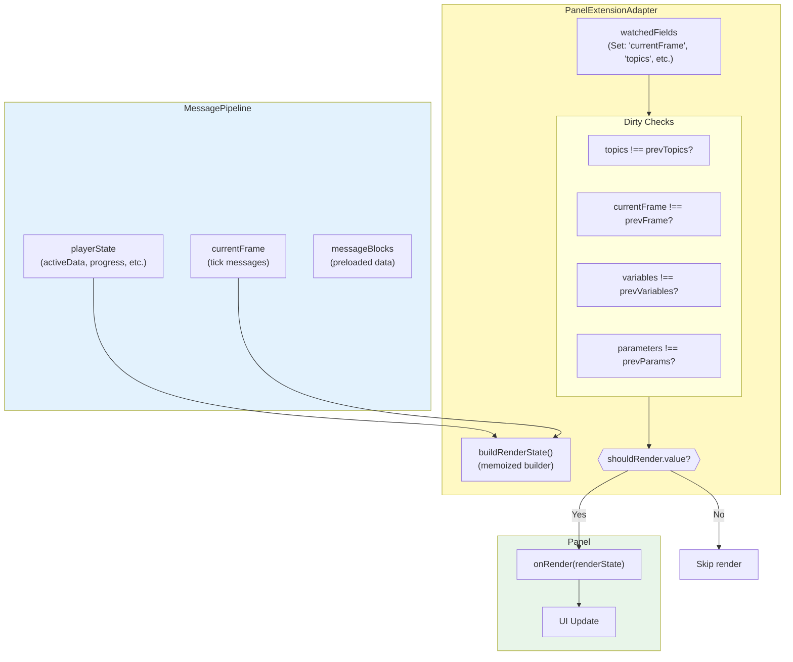
```mermaid
flowchart TB
    subgraph Pipeline["MessagePipeline"]
        PlayerState["playerState<br/>(activeData, progress, etc.)"]
        CurrentFrame["currentFrame<br/>(tick messages)"]
        Blocks["messageBlocks<br/>(preloaded data)"]
    end

    subgraph Adapter["PanelExtensionAdapter"]
        WatchedFields["watchedFields<br/>(Set: 'currentFrame', 'topics', etc.)"]
        BuildRenderState["buildRenderState()<br/>(memoized builder)"]

        subgraph Checks["Dirty Checks"]
            TopicChange["topics !== prevTopics?"]
            FrameChange["currentFrame !== prevFrame?"]
            VarChange["variables !== prevVariables?"]
            ParamChange["parameters !== prevParams?"]
        end

        ShouldRender{{"shouldRender.value?"}}
    end

    subgraph Panel["Panel"]
        OnRender["onRender(renderState)"]
        PanelUI["UI Update"]
    end

    PlayerState --> BuildRenderState
    CurrentFrame --> BuildRenderState
    WatchedFields --> Checks
    Checks --> ShouldRender
    ShouldRender -->|"Yes"| OnRender
    ShouldRender -->|"No"| Skip["Skip render"]
    OnRender --> PanelUI

    style Pipeline fill:#e3f2fd
    style Adapter fill:#fff9c4
    style Panel fill:#e8f5e9
```

**Key optimization:** `buildRenderState()` uses `memoizeWeak` and per-field dirty-checking. Panels that don't subscribe to `currentFrame` don't receive message data — saving significant processing.

### 8.2 Raw Messages — Virtualization

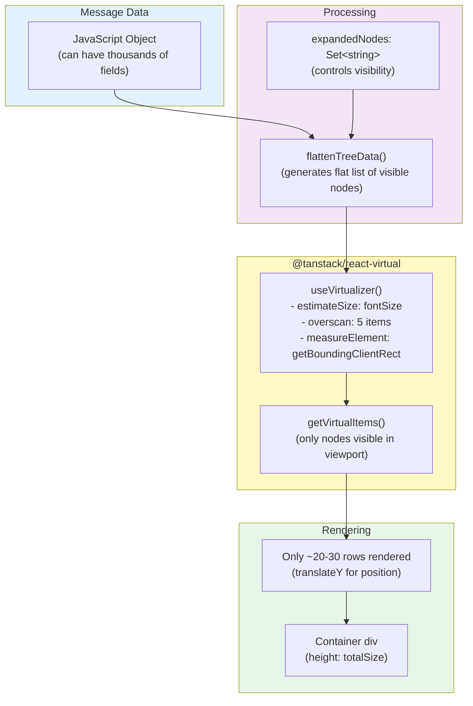
```mermaid
flowchart TB
    subgraph Data["Message Data"]
        MsgObj["JavaScript Object<br/>(can have thousands of fields)"]
    end

    subgraph Processing["Processing"]
        Flatten["flattenTreeData()<br/>(generates flat list of visible nodes)"]
        ExpandSet["expandedNodes: Set&lt;string&gt;<br/>(controls visibility)"]
    end

    subgraph Virtualization["@tanstack/react-virtual"]
        Virtualizer["useVirtualizer()<br/>- estimateSize: fontSize<br/>- overscan: 5 items<br/>- measureElement: getBoundingClientRect"]
        VirtualItems["getVirtualItems()<br/>(only nodes visible in viewport)"]
    end

    subgraph Render["Rendering"]
        Container["Container div<br/>(height: totalSize)"]
        Rows["Only ~20-30 rows rendered<br/>(translateY for position)"]
    end

    MsgObj --> Flatten
    ExpandSet --> Flatten
    Flatten --> Virtualizer
    Virtualizer --> VirtualItems
    VirtualItems --> Rows
    Rows --> Container

    style Data fill:#e3f2fd
    style Processing fill:#f3e5f5
    style Virtualization fill:#fff9c4
    style Render fill:#e8f5e9
```

**Problem without virtualization:** A `PointCloud2` message with 100k points expanded would create 100,000+ DOM nodes → browser freezes.

**With virtualization:** Only ~30 nodes are rendered, regardless of data size.

### 8.3 React Performance Patterns in Lichtblick

| Pattern                   | Where it's used          | Problem it solves                    |
| ------------------------- | ------------------------ | ------------------------------------ |
| `useMemo` / `useCallback` | All panels               | Avoids recalculations on each render |
| `memo()` (React.memo)     | `VirtualizedTree`        | Avoids re-rendering the entire tree  |
| `useLatest` (react-use)   | Config refs              | Avoids panel re-creation             |
| `useDebouncedCallback`    | Settings/Config save     | Avoids excessive saves               |
| `watchedFields`           | Panel render state       | Filters irrelevant data              |
| `memoizeWeak`             | renderState builder      | Cache with GC-friendly keys          |
| `pauseFrame`              | Panel lifecycle          | Synchronizes renders with pipeline   |
| Virtualization            | RawMessages, large lists | Renders only what's visible          |

---

## 9. User Scripts

### 9.1 Execution Architecture

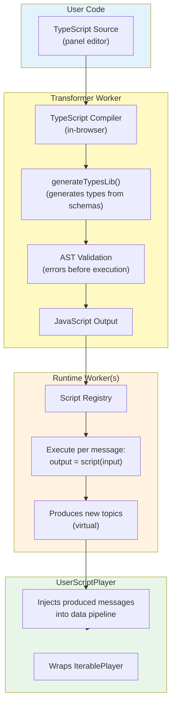
```mermaid
flowchart TB
    subgraph UserCode["User Code"]
        TSSource["TypeScript Source<br/>(panel editor)"]
    end

    subgraph TransformerWorker["Transformer Worker"]
        Compile["TypeScript Compiler<br/>(in-browser)"]
        TypeGen["generateTypesLib()<br/>(generates types from schemas)"]
        Validate["AST Validation<br/>(errors before execution)"]
        JSOutput["JavaScript Output"]
    end

    subgraph RuntimeWorker["Runtime Worker(s)"]
        Registry["Script Registry"]
        Execute["Execute per message:<br/>output = script(input)"]
        NewTopics["Produces new topics<br/>(virtual)"]
    end

    subgraph Player["UserScriptPlayer"]
        Wrap["Wraps IterablePlayer"]
        Inject["Injects produced messages<br/>into data pipeline"]
    end

    TSSource --> Compile
    Compile --> TypeGen
    TypeGen --> Validate
    Validate --> JSOutput
    JSOutput --> Registry
    Registry --> Execute
    Execute --> NewTopics
    NewTopics --> Inject
    Inject --> Player

    style UserCode fill:#e3f2fd
    style TransformerWorker fill:#fff9c4
    style RuntimeWorker fill:#fff3e0
    style Player fill:#e8f5e9
```

### 9.2 User Script Performance

**Execution model:** For EACH message on the subscribed topic, the script executes once.

**Problematic scenario:**

```
Topic /lidar at 100Hz → 100 executions/second of the script
If the script takes 5ms per execution → 500ms/s spent on scripts
→ No time left for rendering!
```

**Performance factors:**
| Factor | Impact | Recommendation |
|--------|--------|----------------|
| Script complexity | Proportional to time per msg | Keep scripts simple |
| Input topic frequency | Linear with number of executions | Prefer low-frequency topics |
| Output size | Memory + serialization | Minimize produced data |
| TypeScript compilation | Latency on first execution | Cache compiled JS |
| Allocations in script | GC pressure | Reuse objects when possible |

---

## 10. Problem and Solution Matrix

### 10.1 Problems by Layer

```mermaid
flowchart LR
    subgraph Symptoms["🔴 Observable Symptoms"]
        S1["App freezes when opening file"]
        S2["Playback choppy / stuttering"]
        S3["Low FPS in 3D panel"]
        S4["Tab crash (OOM)"]
        S5["Slow seek"]
        S6["UI unresponsive"]
        S7["Delayed messages (live)"]
    end

    subgraph RootCauses["🟡 Root Causes"]
        C1["MCAP unindexed > 1GB"]
        C2["Too many msgs per tick window"]
        C3["Large point clouds"]
        C4["Cache exceeds available memory"]
        C5["Too many chunks to traverse"]
        C6["Heavy user script"]
        C7["WebSocket back-pressure"]
    end

    S1 --> C1
    S2 --> C2
    S3 --> C3
    S4 --> C4
    S5 --> C5
    S6 --> C6
    S7 --> C7

    style Symptoms fill:#ffcdd2
    style RootCauses fill:#fff9c4
```

### 10.2 Complete Diagnostic Table

| #   | Symptom                             | Layer        | Root Cause                                           | Diagnosis                                        | Existing Solution                            | Possible Improvement                                |
| --- | ----------------------------------- | ------------ | ---------------------------------------------------- | ------------------------------------------------ | -------------------------------------------- | --------------------------------------------------- |
| 1   | App freezes when opening large MCAP | MCAP Reading | Unindexed file trying to load everything into memory | Check if MCAP has summary section                | 1GB limit for unindexed                      | Partial streaming for unindexed                     |
| 2   | Slow initialization (>10s)          | MCAP Reading | Too many chunk indexes to parse                      | Measure time in `McapIndexedReader.Initialize()` | Preload decompressHandlers                   | Index caching between sessions                      |
| 3   | Choppy playback                     | Player Tick  | Too many messages in 300ms tick window               | Count msgs/tick in debug                         | 300ms cap + EMA smoothing                    | Adaptive tick window, message sampling              |
| 4   | Stutter when starting play          | Buffering    | Empty buffer, waiting for min read-ahead (1s)        | Observe "buffering" state                        | Producer-consumer with condvar               | Predictive pre-buffering                            |
| 5   | OOM / tab crash                     | Caching      | Total cache > tab's available memory                 | Monitor `getCacheSize()`                         | 600MB cap + LRU eviction                     | Adaptive cache sizing based on `performance.memory` |
| 6   | Slow seek in large MCAP             | MCAP I/O     | Seek requires finding correct chunk + decompressing  | Measure time of `getBackfillMessages()`          | Cache reuses already-read blocks             | In-memory chunk index with binary search            |
| 7   | Low FPS in 3D                       | Rendering    | Point clouds with 500k+ points                       | GPU memory in DevTools                           | LOD, DynamicBufferGeometry                   | Octree culling, point budget                        |
| 8   | Low FPS with decay                  | Rendering    | History accumulates geometries                       | Count objects in scene                           | `RenderObjectHistory` with limit             | Instanced rendering for decay                       |
| 9   | Jank when expanding RawMessages     | Panel/React  | DOM explosion without virtualization                 | React DevTools profiler                          | VirtualizedTree with @tanstack/react-virtual | Lazy expansion (load on demand)                     |
| 10  | Delayed live messages               | WebSocket    | Publisher sends faster than UI processes             | Latency between publish and render               | No specific throttle                         | Message dropping / sampling                         |
| 11  | Script execution lag                | User Scripts | Script executes for each message                     | Measure time per execution in worker             | Worker isolation                             | Batch execution, throttle                           |
| 12  | Slow images                         | Rendering    | Large image decode on main thread                    | Performance profiler (decode time)               | `WorkerImageDecoder`                         | WASM decoder, GPU decode                            |
| 13  | Memory grows continuously           | All          | Leaks in closures, event listeners, caches           | Heap snapshot comparison                         | N/A                                          | Periodic cache purge, WeakRef                       |
| 14  | Slow remote file seek               | Remote I/O   | HTTP range request + network latency                 | Network tab, cache hit ratio                     | 500MB CachedFilelike                         | Predictive prefetch                                 |

### 10.3 Prioritization by Impact

| Priority  | Issue                  | Impact      | Frequency   |
| --------- | ---------------------- | ----------- | ----------- |
| 🔴 High   | OOM / Tab Crash        | Very High   | High        |
| 🔴 High   | Choppy Playback        | High        | Very High   |
| 🔴 High   | Low 3D FPS             | High        | High        |
| 🟡 Medium | Slow Seek              | Medium-High | Medium      |
| 🟡 Medium | WebSocket backpressure | Medium      | Medium      |
| 🟡 Medium | Slow Init              | Medium      | Medium-Low  |
| 🟢 Low    | Script Lag             | Medium-Low  | Low         |
| 🟢 Low    | Image decode           | Low-Medium  | Medium-High |
| 🟢 Low    | RawMsg jank            | Low         | Medium      |
| 🟢 Low    | Remote seek            | Medium-Low  | Low         |

---

## 11. Code References

### Critical Files by Layer

#### Data Sources

| File                                                                        | Responsibility                 |
| --------------------------------------------------------------------------- | ------------------------------ |
| `packages/suite-base/src/dataSources/McapLocalDataSourceFactory.ts`         | Player creation for local file |
| `packages/suite-base/src/dataSources/RemoteDataSourceFactory.tsx`           | Player creation for remote URL |
| `packages/suite-base/src/dataSources/FoxgloveWebSocketDataSourceFactory.ts` | WebSocket player creation      |

#### MCAP Reading

| File                                                                                     | Responsibility            |
| ---------------------------------------------------------------------------------------- | ------------------------- |
| `packages/suite-base/src/players/IterablePlayer/Mcap/McapIterableSource.ts`              | Entry point (file vs url) |
| `packages/suite-base/src/players/IterablePlayer/Mcap/McapIndexedIterableSource.ts`       | Indexed reading           |
| `packages/suite-base/src/players/IterablePlayer/Mcap/McapUnindexedIterableSource.ts`     | Sequential reading        |
| `packages/suite-base/src/players/IterablePlayer/Mcap/McapIterableSourceWorker.worker.ts` | Worker thread             |
| `packages/suite-base/src/players/IterablePlayer/Mcap/RemoteFileReadable.ts`              | HTTP range + cache        |
| `packages/suite-base/src/players/IterablePlayer/shared/MultiIterableSource.ts`           | Multiple files            |

#### Worker & Deserialization

| File                                                                                     | Responsibility              |
| ---------------------------------------------------------------------------------------- | --------------------------- |
| `packages/suite-base/src/players/IterablePlayer/WorkerSerializedIterableSource.ts`       | Comlink proxy (main thread) |
| `packages/suite-base/src/players/IterablePlayer/WorkerSerializedIterableSourceWorker.ts` | Comlink host (worker)       |
| `packages/suite-base/src/players/IterablePlayer/DeserializingIterableSource.ts`          | Deserialization pipeline    |
| `packages/suite-base/src/players/messageMemoryEstimation.ts`                             | V8 memory model             |

#### Buffering & Caching

| File                                                                       | Responsibility           |
| -------------------------------------------------------------------------- | ------------------------ |
| `packages/suite-base/src/players/IterablePlayer/BufferedIterableSource.ts` | Producer-consumer buffer |
| `packages/suite-base/src/players/IterablePlayer/CachingIterableSource.ts`  | LRU block cache          |
| `packages/suite-base/src/players/IterablePlayer/BlockLoader.ts`            | Block-based preloading   |

#### Player

| File                                                               | Responsibility            |
| ------------------------------------------------------------------ | ------------------------- |
| `packages/suite-base/src/players/IterablePlayer/IterablePlayer.ts` | State machine + tick loop |

#### User Scripts

| File                                                                          | Responsibility   |
| ----------------------------------------------------------------------------- | ---------------- |
| `packages/suite-base/src/players/UserScriptPlayer/index.ts`                   | Player wrapper   |
| `packages/suite-base/src/players/UserScriptPlayer/transformerWorker/index.ts` | TS compilation   |
| `packages/suite-base/src/players/UserScriptPlayer/runtimeWorker/index.ts`     | Script execution |

#### 3D Rendering

| File                                                                                     | Responsibility         |
| ---------------------------------------------------------------------------------------- | ---------------------- |
| `packages/suite-base/src/panels/ThreeDeeRender/ThreeDeeRender.tsx`                       | Panel component        |
| `packages/suite-base/src/panels/ThreeDeeRender/Renderer.ts`                              | THREE.js renderer core |
| `packages/suite-base/src/panels/ThreeDeeRender/renderables/PointClouds.ts`               | Point cloud rendering  |
| `packages/suite-base/src/panels/ThreeDeeRender/renderables/Images/WorkerImageDecoder.ts` | Image worker           |

#### Panel/React

| File                                                                                 | Responsibility       |
| ------------------------------------------------------------------------------------ | -------------------- |
| `packages/suite-base/src/components/PanelExtensionAdapter/PanelExtensionAdapter.tsx` | Panel lifecycle      |
| `packages/suite-base/src/components/PanelExtensionAdapter/renderState.ts`            | Render state builder |
| `packages/suite-base/src/panels/RawMessagesVirtual/VirtualizedTree.tsx`              | Virtualized tree     |
| `packages/suite-base/src/panels/RawMessagesVirtual/flattenTreeData.ts`               | Tree flattening      |

---

## Appendix: Glossary

| Term                | Definition                                                                       |
| ------------------- | -------------------------------------------------------------------------------- |
| **MCAP**            | File format for recording robotics data (replacement for ROS bags)               |
| **Chunk**           | Compressed block of messages within an MCAP                                      |
| **Channel**         | Equivalent to a ROS topic within the MCAP                                        |
| **Tick**            | One read cycle of the player (typically aligned with requestAnimationFrame)      |
| **Read-ahead**      | Amount of data preloaded ahead of the current playback position                  |
| **Backfill**        | Fetching the last message of each topic before the current time (for seek)       |
| **Block (cache)**   | Cache segment with a defined time range                                          |
| **Block (preload)** | Time division for historical data preloading                                     |
| **Transferable**    | JavaScript object whose ownership can be transferred between threads (zero-copy) |
| **Comlink**         | Library that abstracts Web Worker communication as function calls                |
| **LOD**             | Level of Detail — visual quality adjustment based on complexity                  |
| **EMA**             | Exponential Moving Average — smoothing of temporal values                        |
