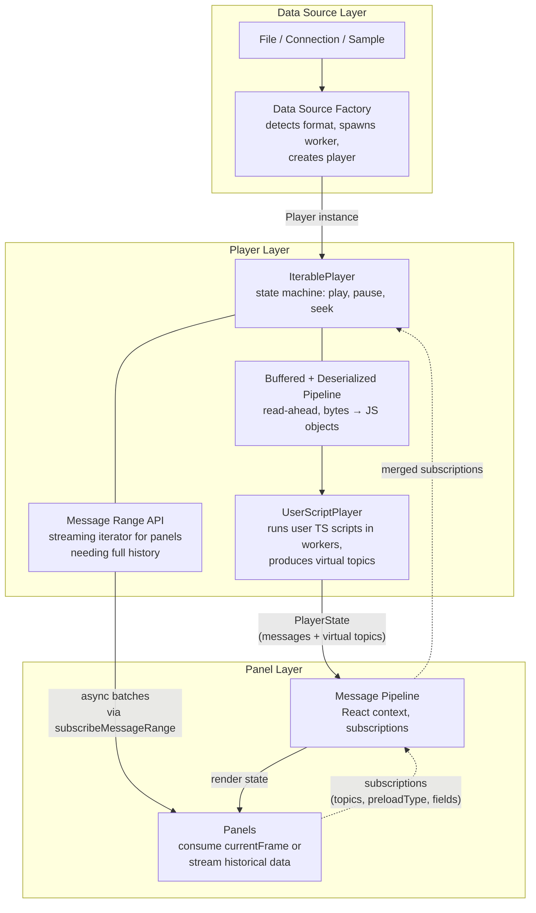
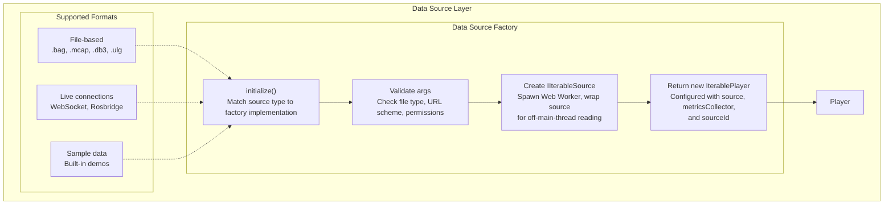
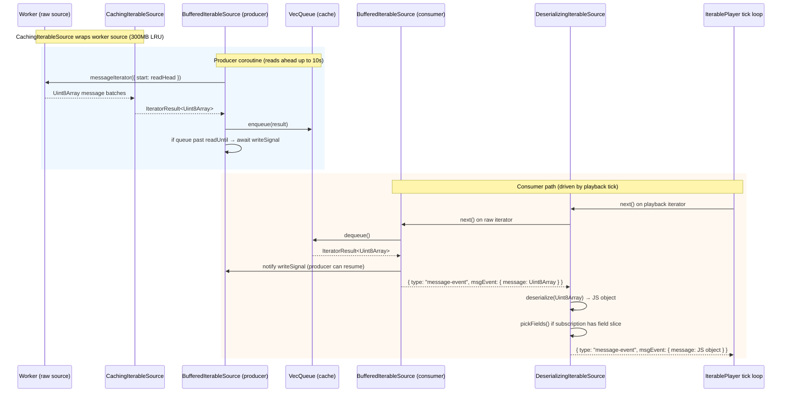
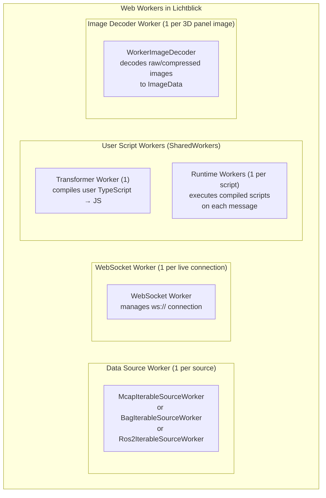
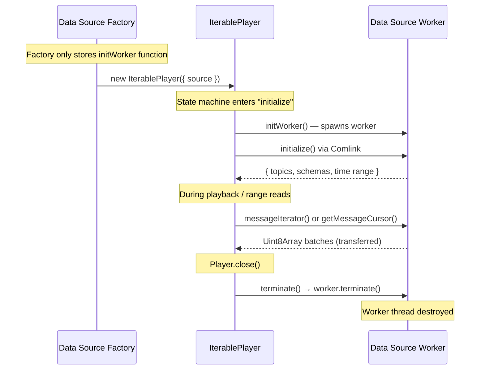
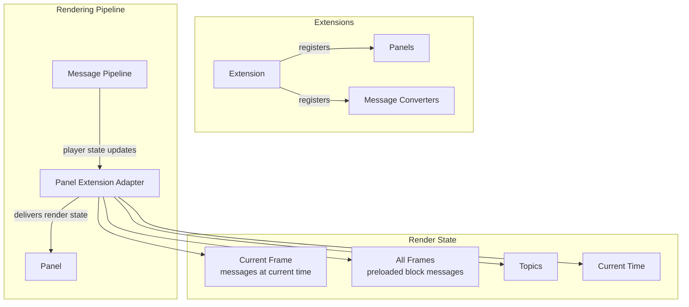
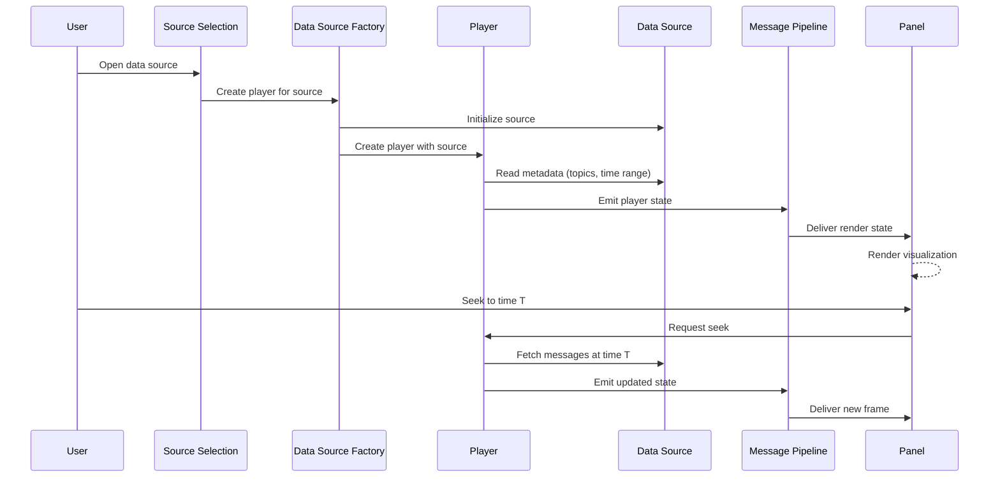

# Lichtblick Architecture Diagrams

## High-Level Overview



---

## 1. Data Source Layer



## 1.1 Worker / Main Thread Boundary

The Web Worker is spawned during the "Create IIterableSource" step above. All file I/O and container parsing runs off the main thread.

```mermaid
flowchart LR
    subgraph "Web Worker"
        direction TB
        IO["File / Network I/O\nread bytes from .mcap, .bag, .db3, .ulg"]
        IO --> Decompress["Chunk Decompression\nzstd, lz4"]
        Decompress --> Extract["Message Record Extraction\nslice individual message payloads\nas Uint8Array from chunk"]
        Extract --> Cursor["Cursor / Iterator\nbatches ~17ms of messages\nper RPC call"]
    end

    subgraph "Transfer"
        direction TB
        Comlink["Comlink RPC\nArrayBuffers transferred\n(zero-copy, ownership moves\nto main thread)"]
    end

    subgraph "Main Thread"
        direction TB
        Buffer2["Buffered Source\nread-ahead buffer\n(producer-consumer)"]
        Buffer2 --> Schema["Schema Lookup\npre-built MessageReader\nper topic (created once\nduring initialize)"]
        Schema --> Decode["Per-message Decode\nreadMessage() or JSON.parse()\nbinary → JS object\n(pure CPU, no I/O)"]
        Decode --> Player["Player State Machine\nemits PlayerState\nto panels"]
    end

    Cursor --> Comlink --> Buffer2
```



### What runs in the Web Worker

| Step | Description |
|------|-------------|
| **File I/O** | Reads raw bytes from the data source (local file via `Blob.slice`, or network via `fetch`) |
| **Index Parsing** | Parses the container format's index/header to discover topics, schemas, time range (done once during `initialize()`) |
| **Chunk Decompression** | Decompresses message chunks (zstd, lz4) back into raw records |
| **Message Extraction** | Slices individual message payloads as `Uint8Array` from decompressed chunk data |
| **Batched Cursor** | Groups messages into ~17ms batches to minimize RPC overhead (one batch ≈ one render frame) |

### What runs on the Main Thread

| Step | Description |
|------|-------------|
| **Buffer (read-ahead)** | Producer-consumer buffer that keeps messages ready ahead of playback position |
| **Schema-based Deserialization** | Uses pre-compiled `MessageReader` instances (one per topic, built from schema during `initialize()`) to decode each `Uint8Array` into a JS object — field by field according to the encoding (CDR, protobuf, JSON, flatbuffer) |
| **Message Slicing** | Optionally picks only requested fields from the decoded object (for panels that subscribe to partial data) |
| **Player State Emission** | Packages decoded messages + metadata into `PlayerState` and delivers to panels |

### Data Transfer Mechanism

- **Comlink** provides the RPC layer between main thread and worker (proxy-based, async method calls)
- **`Comlink.transfer()`** moves `ArrayBuffer` ownership to the main thread (zero-copy, no `structuredClone`)
- **`ComlinkTransferIteratorCursor`** wraps the worker-side cursor and marks all message buffers as transferable
- **AbortSignal** is proxied across the boundary via a custom Comlink transfer handler (since it's not cloneable)

### Buffered + Deserializing Source Interaction

The playback pipeline chains three layers on the main thread. Buffering operates on **raw bytes** so the 300MB cache holds compact `Uint8Array` messages; deserialization is deferred until the consumer actually reads at playback speed.



**Construction** (in `IterablePlayer` constructor for serialized sources):
```
source (WorkerSerializedIterableSource)
  └─ CachingIterableSource (LRU, 300MB max, evicts oldest blocks)
       └─ BufferedIterableSource (producer-consumer, 10s read-ahead, Condvar sync)
            └─ DeserializingIterableSource (schema decode + field slicing + sampling)
                 = #bufferedSource (what the player's tick loop reads from)
```

**Key behaviors:**
- **Producer** reads from the worker continuously, filling the `VecQueue` until 10s ahead of the consumer's `readHead`
- **Consumer** (the tick loop) dequeues one item at a time; each dequeue notifies the producer via `writeSignal`
- **Backpressure**: producer `await`s `writeSignal` when buffer is full OR the read position is >10s ahead
- **Min buffer**: consumer `await`s `readSignal` when queue is empty OR hasn't buffered at least 1s ahead (`minReadAheadDuration`)
- **Deserialization is lazy**: raw bytes sit in the queue; decode happens only when the consumer pulls an item
- **Sampling** (`latest-per-render-tick`): `DeserializingIterableSource` can drop intermediate messages for sampled topics, only deserializing the latest per window

## 1.2 Web Workers Overview



### Worker Inventory

| Worker | Type | Count | Spawned When | Purpose | Terminated When |
|--------|------|-------|--------------|---------|-----------------|
| **Data Source** | `Worker` | 1 per open file/URL | Player `initialize()` is called (not at factory time) | File I/O, index parsing, chunk decompression, raw message extraction (yields `Uint8Array`) | Player `close()` → `WorkerSerializedIterableSource.terminate()` → `worker.terminate()` |
| **WebSocket** | `Worker` | 1 per live connection | `WorkerSocketAdapter` constructor | Manages WebSocket connection off main thread, transfers binary frames via zero-copy | Connection closes or player is disposed |
| **Transformer** | `SharedWorker` | 1 total | First user script is registered | Compiles user TypeScript code to JavaScript | Never explicitly terminated (shared, lives for app lifetime) |
| **Runtime** | `SharedWorker` | 1 per active user script | Script registration succeeds | Executes compiled JS on each message to produce virtual topic output | Script is removed or errors; worker returned to `#unusedRuntimeWorkers` pool |
| **Image Decoder** | `Worker` | 1 per `ImageRenderable` instance | 3D panel renders a raw image topic | Decodes raw pixel data (bayer, YUV, etc.) to `ImageData`, transfers result back | `ImageRenderable.dispose()` → `decoder.terminate()` |

### Lifecycle



## 2. Player Layer

```mermaid
flowchart TD
    subgraph "Player Layer"
        subgraph "Playback States"
            Init[Initializing] --> Idle[Idle]
            Idle -->|"play"| Playing[Playing]
            Playing -->|"pause"| Idle
            Idle -->|"seek"| Seeking[Seeking]
            Playing -->|"seek"| Seeking
            Seeking --> Idle
        end

        subgraph "Source Pipeline (see 1.1 for details)"
            Worker["Web Worker\nI/O, decompression, extraction"] -->|"Uint8Array batches"| Buffer["Buffered Source\nread-ahead"]
            Buffer --> Deser["Deserializing Source\ndecodes bytes → JS objects"]
        end

        subgraph "Panel Data Access"
            RangeSource["Message Range Source\n(getBatchIterator)\ndirect iterator over source\nfor full-topic streaming"]
            BlockLoader["Block Loader (legacy)\npreloads into fixed blocks\nlargely unused by panels"]
        end
    end

    subgraph "Player Output"
        PS[PlayerState]
        PS --- ActiveData["Active Data\nmessages, current time,\ntopics, playback status"]
        PS --- Progress["Progress\nloaded ranges, cached blocks"]
        PS --- Presence["Presence\ninitializing / present / buffering"]
    end

    Playing & Seeking & Idle -->|"emits"| PS
```



### Panel Data Access: BlockLoader vs subscribeMessageRange

Panels that need **all historical data** (e.g., Plot in time mode, 3D transform preloading) have moved from `BlockLoader` to `subscribeMessageRange`:

| | BlockLoader (legacy) | subscribeMessageRange (current) |
|---|---|---|
| **Mechanism** | Preloads entire file into fixed-time blocks stored in memory | Provides an async iterator directly over the source |
| **Data delivery** | Panels read from `progress.messageCache.blocks` | Panels consume batches via `onNewRangeIterator` callback |
| **Memory model** | 1GB cache with block eviction | Streaming — panels manage their own data structures |
| **Cache** | Centralized block array | None — reads directly from the raw source each time |
| **Panel control** | No backpressure; loads all subscribed topics | Panel pulls at its own pace via `for await` |
| **Status** | Still runs for `preloadType: "full"` subscriptions but panels mostly ignore the blocks | Used by Plot (`PlotCoordinator`) and 3D (transform preloading) |

`getBatchIterator` on `IterablePlayer` creates a fresh `messageIterator` over the `#messageRangeSource` (a `DeserializingIterableSource` wrapping the raw source). This means each panel subscription reads directly from the underlying data source with its own deserialization pass, bypassing the buffered playback pipeline entirely.

## 3. Panel / Extension Layer



## 4. End-to-End Flow


